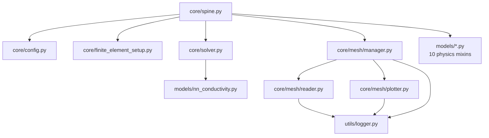

# Z3ST architecture - UML class diagram

Z3ST is built around a single hub class, `Spine` (`z3st/core/spine.py`), which a
simulation instantiates once. Every physics model and every infrastructure class
is a **mixin**: `Spine` multiply-inherits from all of them, and each mixin
contributes methods that read and write the shared state living on `Spine`
(`u`, `T`, `D`, `porosity`, `burnup`, ...). None of the model classes is usable
on its own.

The diagrams below render natively on GitHub (Mermaid). They were extracted
from the source with `pyreverse` and curated for readability — see
[Regenerating](#regenerating) at the bottom.

## Class diagram

```mermaid
classDiagram
  direction BT

  class Spine {
    +u, T, D, porosity, burnup : Function
    +c, H, gas_swelling, q_third : Function
    +materials : dict
    +stress, strain, energy_density
    +mgr : MeshManager
    +solve(max_iters, dt)
    +update_state(dt)
    +initialize_fields()
    +load_materials()
    +set_boundary_conditions()
    +set_power()
    +snapshot_state() / restore_state(snap)
    +get_results()
  }

  class ThermalModel {
    +dirichlet, neumann, robin BCs
    +heat_flux(T)
    +set_thermal_boundary_conditions(V_t)
  }
  class MechanicalModel {
    +dirichlet_mechanical, traction
    +sigma_mech(u, material)
    +sigma_th(T, material)
    +eigenstrain(T, material)
    +hyperelastic_residual(u, v, material, dx, w)
  }
  class DamageModel {
    +dmg_cfg, dirichlet_damage
    +crack_driving_force(u, material, T)
    +psi_split(u, material, T)
    +degradation_function(D, K)
    +update_history(u, T)
  }
  class PlasticityModel {
    +ep, ep_n, p, p_n : Function
    +sigma_plastic(u, material)
    +update_plastic_history(u)
  }
  class CreepModel {
    +eps_cr : dict
    +creep_stress(u, material, T, dt)
    +update_creep_state(u, T)
  }
  class ContactModel {
    +k_pen, g0, contact_pressure
    +contact_traction(v)
    +update_contact_pressure(u)
  }
  class GapModel {
    +gap_temperature
    +contact_conductance()
    +set_gap_conductance(T_i)
  }
  class PorosityMigrationModel {
    +H_s, v0, c1..c4
    +set_porosity_initial_conditions()
    +update_porosity_dependent_properties(T_eval, p_eval)
  }
  class ClusterDynamicsModel {
    +D_cluster, v_cluster
    +set_cluster_initial_conditions()
  }
  class CrackingModel {
    +cracking_active(material)
    +update_cracking()
  }

  class Config {
    +input_file, mesh_path, n_steps
    +on : dict (physics switches)
    +gap_*, sciantix_* settings
  }
  class FiniteElementSetup {
    +V_m, V_t, V_d, V_p, V_c, V_pl
    +Q, Q_pl, q_degree
  }
  class Solver {
    +dt, coupling
    +relax_* (Aitken adaptive relaxation)
    +solve_staggered(...)
    +get_solver_options(physics, solver_type, rtol)
  }

  class MeshManager {
    +mesh, cell_tags, facet_tags
    +geometry, label_map
    +locate_domain_dofs(label, V)
    +locate_facets_dofs(label, V)
  }
  class GmshMeshReader {
    +load(mesh_path, gdim)
  }
  class XdmfMeshReader {
    +load(mesh_path)
  }
  class MeshPlotter {
    +show(screenshot)
  }
  class NNConductivity {
    +value_and_grad(T_array)
  }

  Spine --|> ThermalModel
  Spine --|> MechanicalModel
  Spine --|> DamageModel
  Spine --|> PlasticityModel
  Spine --|> CreepModel
  Spine --|> ContactModel
  Spine --|> GapModel
  Spine --|> PorosityMigrationModel
  Spine --|> ClusterDynamicsModel
  Spine --|> CrackingModel
  Spine --|> Config
  Spine --|> FiniteElementSetup
  Spine --|> Solver

  Spine *-- MeshManager : mgr
  MeshManager ..> GmshMeshReader
  MeshManager ..> XdmfMeshReader
  MeshManager ..> MeshPlotter
  Solver ..> NNConductivity
```



Legend: `--|>` inheritance (mixin), `*--` composition, `..>` uses.

## Module dependencies



## Design notes

* **Composition root** — `Spine.solve()` drives the staggered coupling loop
  provided by the `Solver` mixin; the physics mixins supply the residuals and
  state updates it orchestrates.
* **One flat namespace** — with 13 parent classes, a method-name collision
  between two mixins resolves silently by MRO order. New model methods should
  carry distinctive names (`creep_stress`, `sigma_plastic`), never generic ones
  (`stress`, `update`).
* **The only composition** — `MeshManager` is held as `Spine.mgr` rather than
  inherited, since mesh handling has a life of its own (readers, plotter,
  diagnostics).

## Regenerating

`pyreverse` (ships with `pylint`) re-extracts the structure from source:

```bash
conda activate z3st
cd <repo root>
pip install pylint                                  # once
pyreverse -o mmd -p z3st z3st.models z3st.core      # Mermaid text
pyreverse -o html -p z3st z3st.models z3st.core     # standalone interactive page
```

This produces `classes_z3st.mmd` / `packages_z3st.mmd`; paste the relevant
parts into the fenced `mermaid` blocks above (the raw output is complete but
noisy — the diagrams here are curated). Widen the scope with `z3st.coupling`
or `z3st.materials` if needed.
