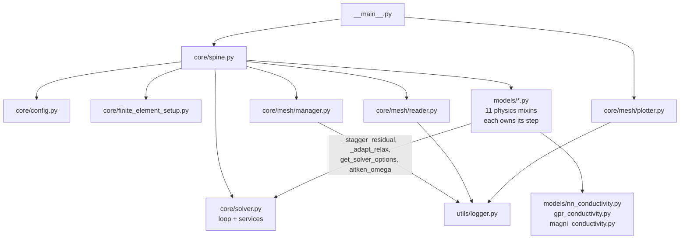

# Z3ST architecture - UML class diagram

Z3ST is built around a single hub class, `Spine` (`z3st/core/spine.py`), which a
simulation instantiates once. Every physics model and every infrastructure class
is a **mixin**: `Spine` multiply-inherits from all of them, and each mixin
contributes methods that read and write the shared state living on `Spine`
(`u`, `T`, `D`, `porosity`, `burnup`, ...). None of the model classes is usable
on its own.

The diagrams below are Mermaid and render on GitHub. They are extracted from
the source with `pyreverse` and reduced by hand (see
[Regenerating](#regenerating)).

## Class diagram


```mermaid
classDiagram
  direction BT

  class Spine {
    +u, T, D, porosity, burnup : Function
    +c, H, gas_swelling, q_third : Function
    +materials : dict
    +stress, strain, energy_density
    +mgr : MeshManager
    +solve(max_iters, dt)
    +update_state(dt)
    +initialize_fields()
    +load_materials()
    +set_boundary_conditions()
    +set_power()
    +snapshot_state() / restore_state(snap)
    +get_results()
  }

  class ThermalModel {
    +dirichlet, neumann, robin BCs
    +heat_flux(T)
    +set_thermal_boundary_conditions(V_t)
    +_thermal_step(...) / _thermal_step_nonlinear(...)
  }
  class MechanicalModel {
    +_mechanical_step(...)
    +dirichlet_mechanical, traction
    +sigma_mech(u, material)
    +sigma_th(T, material)
    +eigenstrain(T, material)
    +hyperelastic_residual(u, v, material, dx, w)
  }
  class DamageModel {
    +_damage_step(...)
    +dmg_cfg, dirichlet_damage
    +crack_driving_force(u, material, T)
    +psi_split(u, material, T)
    +degradation_function(D, K)
    +update_history(u, T)
  }
  class PlasticityModel {
    +ep, ep_n, p, p_n : Function
    +sigma_plastic(u, material)
    +update_plastic_history(u)
  }
  class CreepModel {
    +eps_cr : dict
    +creep_stress(u, material, T, dt)
    +update_creep_state(u, T)
  }
  class ContactModel {
    +k_pen, g0, contact_pressure
    +contact_traction(v)
    +update_contact_pressure(u)
  }
  class GapModel {
    +gap_temperature
    +contact_conductance()
    +set_gap_conductance(T_i)
  }
  class PorosityMigrationModel {
    +_porosity_step(...)
    +H_s, v0, c1..c4
    +set_porosity_initial_conditions()
    +update_porosity_dependent_properties(T_eval, p_eval)
  }
  class ClusterDynamicsModel {
    +_cluster_step(...)
    +D_cluster, v_cluster
    +set_cluster_initial_conditions()
  }
  class CrackingModel {
    +cracking_active(material)
    +update_cracking()
  }
  class CohesiveModel {
    +coh_cfg
    +_cohesive_step(...)
    +strength_potential(p, q, material)
    +sigma_cohesive(u, p, q, material)
    +cohesive_bounds()
  }

  class Config {
    +input_file, mesh_path, n_steps
    +on : dict (physics switches)
    +gap_*, sciantix_* settings
  }
  class FiniteElementSetup {
    +V_m, V_t, V_d, V_p, V_c, V_pl
    +Q, Q_pl, q_degree
  }
  class Solver {
    +dt, relax_* (Aitken / adaptive)
    +solve_staggered(...)
    +get_solver_options(physics, solver_type, rtol)
    +_stagger_residual(new, old, cfg, tol, label)
    +_adapt_relax(name, residual, prev)
  }

  class MeshManager {
    +mesh, cell_tags, facet_tags
    +geometry, label_map
    +locate_domain_dofs(label, V)
    +locate_facets_dofs(label, V)
  }
  class load_mesh {
    <<function>>
    +load_mesh(mesh_path, comm, gdim)
  }
  class MeshPlotter {
    +show(screenshot)
  }
  class NNConductivity {
    +value_and_grad(T_array)
  }
  class GPRConductivity {
    +value_and_grad(T_array, ...)
  }
  class MagniConductivity {
    +value_and_grad(T_array, ...)
  }
  class make_external_operator {
    <<function>>
  }
  class main {
    <<module __main__>>
    +main()
  }

  Spine --|> ThermalModel
  Spine --|> MechanicalModel
  Spine --|> DamageModel
  Spine --|> PlasticityModel
  Spine --|> CreepModel
  Spine --|> ContactModel
  Spine --|> GapModel
  Spine --|> PorosityMigrationModel
  Spine --|> ClusterDynamicsModel
  Spine --|> CrackingModel
  Spine --|> CohesiveModel
  Spine --|> Config
  Spine --|> FiniteElementSetup
  Spine --|> Solver

  Spine *-- MeshManager : mgr
  Spine ..> load_mesh
  main ..> Spine
  main ..> MeshPlotter : --mesh_plot
  Spine ..> NNConductivity : load_from_card
  Spine ..> GPRConductivity : load_from_card
  Spine ..> MagniConductivity : load_from_card
  ThermalModel ..> make_external_operator
  GPRConductivity ..> MagniConductivity
```

Legend: `--|>` inheritance (mixin), `*--` composition, `..>` uses.

`Spine` has 14 parent classes: `Config`, `FiniteElementSetup`, `Solver` and 11
physics models (`ThermalModel`, `MechanicalModel`, `GapModel`, `ContactModel`,
`DamageModel`, `CohesiveModel`, `ClusterDynamicsModel`, `PlasticityModel`,
`CreepModel`, `CrackingModel`, `PorosityMigrationModel`). The conductivity
models are not parents: `Spine.load_materials` builds one from a material card
whose `k` entry has `type: neural_network`, `gpr` or `magni`, and
`ThermalModel` wraps it with `make_external_operator`
(`models/nn_conductivity.py`) when `thermal.solver` is not `linear` (the cases use `newton`).
`CohesiveModel` is described in the page on models under development.

## Module dependencies


```mermaid
flowchart TD
  spine[core/spine.py] --> config[core/config.py]
  spine --> fes[core/finite_element_setup.py]
  spine --> solver["core/solver.py<br/>loop + services"]
  spine --> manager[core/mesh/manager.py]
  spine --> reader[core/mesh/reader.py]
  spine --> models["models/*.py<br/>11 physics mixins<br/>each owns its step"]
  main["__main__.py"] --> spine
  main --> plotter[core/mesh/plotter.py]
  manager --> logger[utils/logger.py]
  reader --> logger
  plotter --> logger
  models -->|"_stagger_residual, _adapt_relax,<br/>get_solver_options, aitken_omega"| solver
  models --> nn["models/nn_conductivity.py<br/>gpr_conductivity.py<br/>magni_conductivity.py"]
```

The models import helpers from the solver. Each physics mixin owns its
staggered step (`_thermal_step`, `_mechanical_step`, `_damage_step`,
`_cohesive_step`, `_cluster_step`, `_porosity_step`) and calls the solver's
helpers. `core/solver.py` holds `solve_staggered` plus
`get_solver_options`, `_stagger_residual`, `_adapt_relax`, `_bc_objects`,
`_value_at_step`, `_build_measures`, and the module-level `as_bool`, `aitken_omega`
and the three rigid-body nullspace builders.

## Design notes

* **Composition root.** `Spine.solve()` runs the staggered loop of the `Solver`
  mixin. Each physics mixin supplies its residual and state update in its own
  `_<physics>_step`.
* **One flat namespace.** With 14 parent classes, a method-name collision
  between two mixins is resolved by MRO order without a message. Model methods
  carry distinctive names (`creep_stress`, `sigma_plastic`).
  `python -m z3st.utils.audit_checks mro` lists any collision.
* **Rank-symmetric Python state.** The PETSc wrappers of dolfinx do collective
  work in `__del__`. If one MPI rank holds a different set of live Python
  objects, the destructors run in a different order and the run deadlocks at
  exit. An object installed per rank (output filter, cache, debug hook) has the
  same type on every rank and differs only by a flag. See
  `__main__.py::_install_stdout_filters`.
* **One output channel.** `print` and `log.*` both reach stdout, through the
  Markdown filter installed by `__main__`, into `log_z3st.md`.
  `plot_convergence.py` parses that file, and CI prints its tail on failure. Both
  parse the markers `## Step` and `#### Iteration` and the residual strings
  `||ΔX||/||X|| = <float>`.
* **The only composition.** `MeshManager` is held as `Spine.mgr`, not
  inherited.

## Regenerating

`pyreverse` (ships with `pylint`) re-extracts the structure from source:

```bash
conda activate z3st
cd <repo root>
pip install pylint                                  # once
pyreverse -o mmd -p z3st z3st.models z3st.core      # Mermaid text
pyreverse -o html -p z3st z3st.models z3st.core     # standalone interactive page
```

This writes `classes_z3st.mmd` and `packages_z3st.mmd`. The diagrams above are
a hand-picked subset of them. Add `z3st.coupling` or `z3st.materials` to the
command to include those packages.
