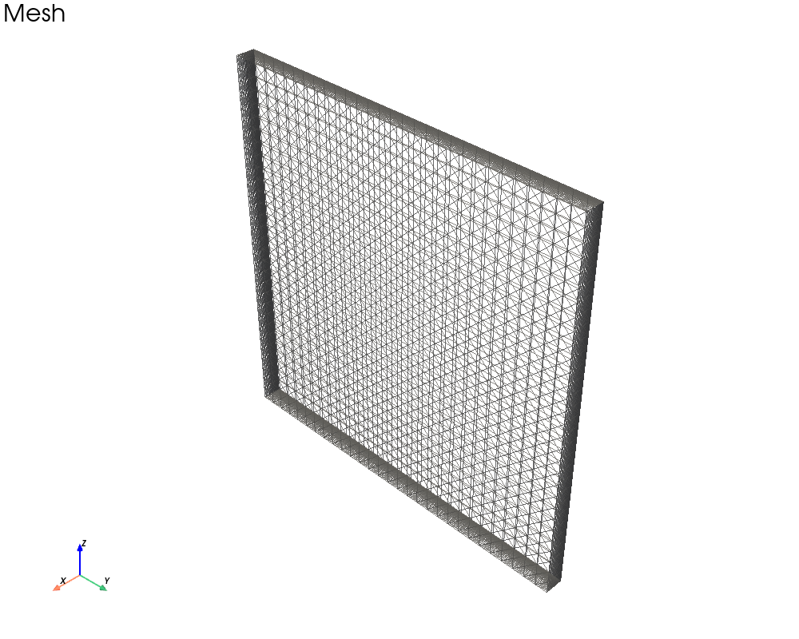
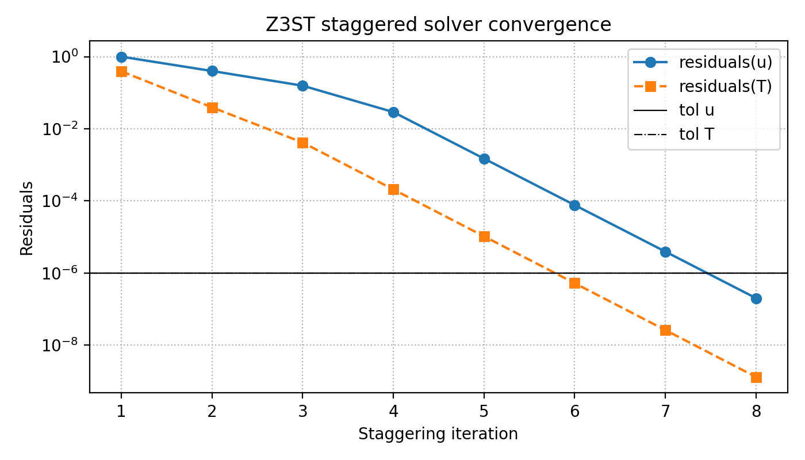
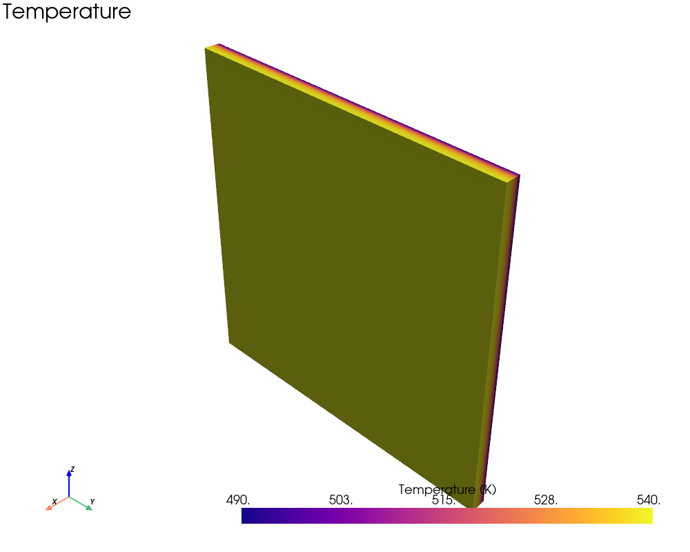
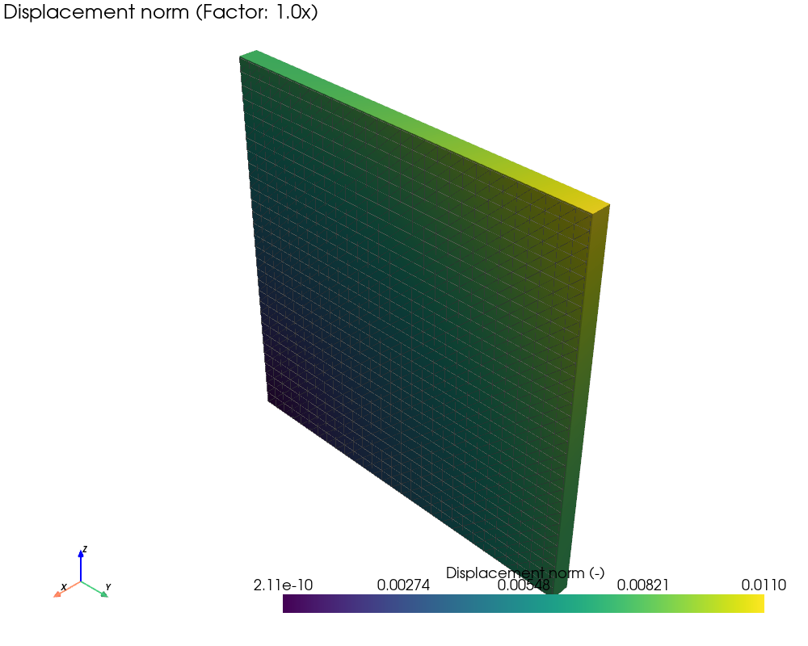
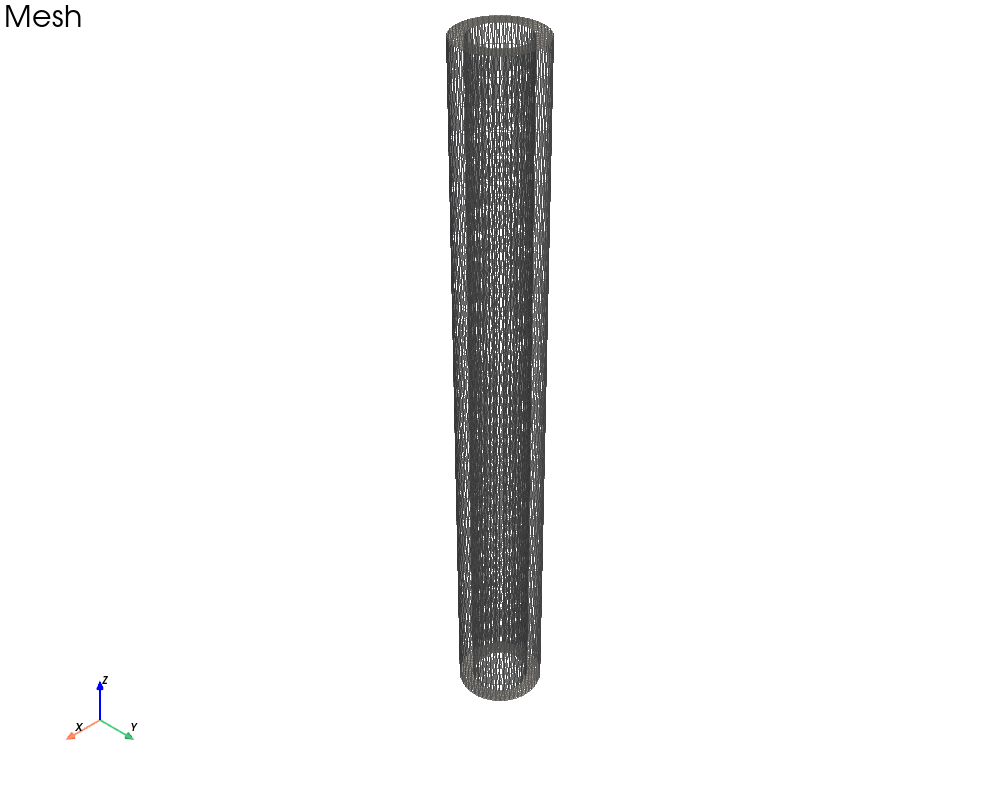
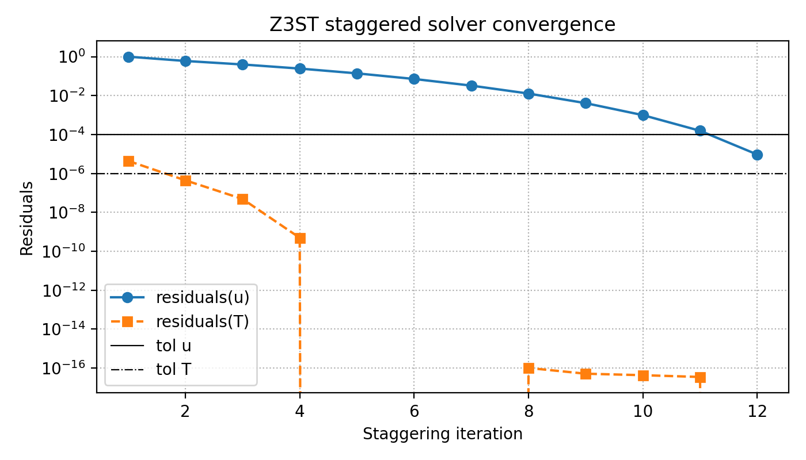
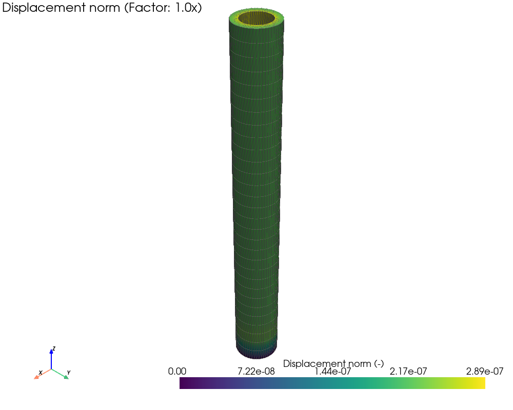
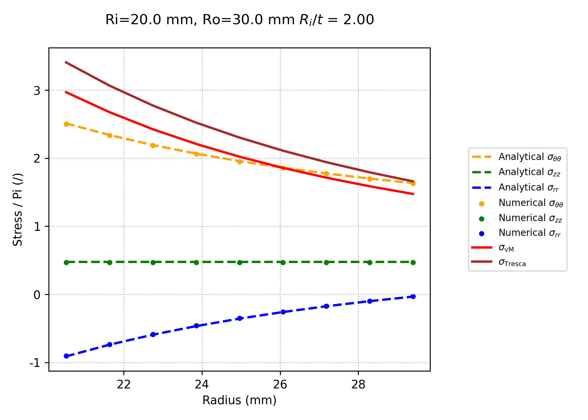
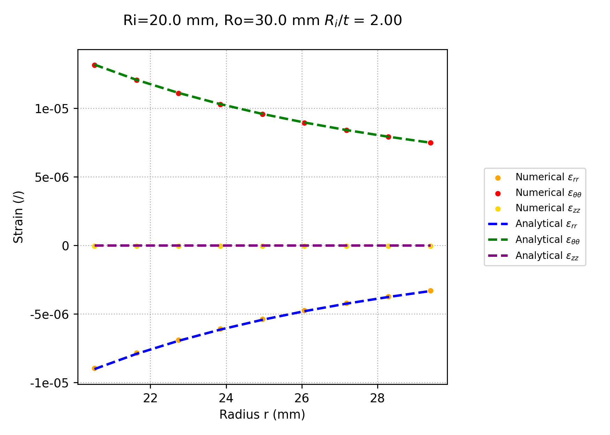
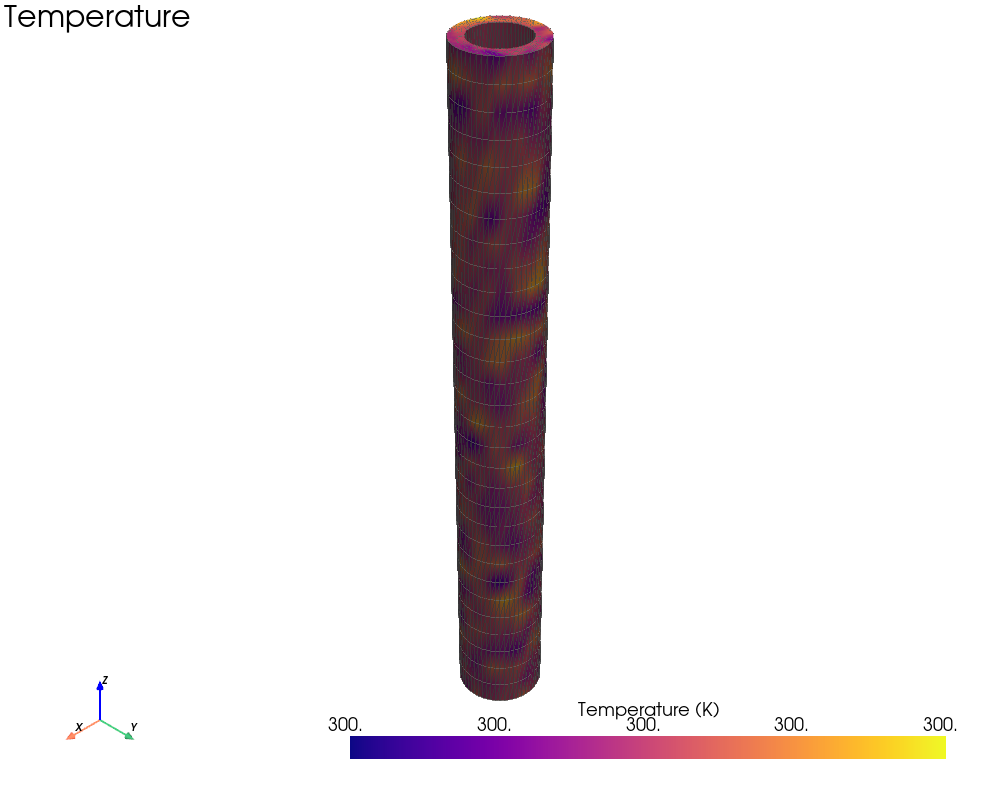

Examples
========

This section documents reference examples distributed with Z3ST.
Each example corresponds to a fully reproducible simulation located in the
``z3st/examples`` directory of the repository.

Thin slab
---------

This example considers a thin slab subjected to a prescribed temperature on a region, and an adiabatic condition on another region.
The case is used as a **thermo-mechanical verification benchmark**, comparing Z3ST results against a analytical reference solutions.

Direct links to the documented examples:

- `Thin slab under thermal loading <https://github.com/giozu/z3st/tree/main/z3st/examples/thin_slab>`_

Geometry and loading
^^^^^^^^^^^^^^^^^^^^

- Slab thickness: :math:`L_x`
- In-plane dimensions: :math:`L_y \times L_z`

The material is linear elastic and isotropic.
Small-strain thermo-elasticity is assumed.

Mesh
^^^^

The domain is discretized with a finite element mesh.

   Finite element mesh of the thin slab.

   Convergence of the solution during the simulation.

Results
^^^^^^^

Temperature field:

   Temperature distribution with mesh overlay.

Displacement field:

   Displacement norm with mesh overlay.

Cylindrical shell under pressure
--------------------------------

This example shows a thick-walled cylindrical shell subjected to internal pressure.
The case is used as a **verification benchmark**, comparing Z3ST results against the analytical Lamé solution.

Direct links to the documented examples:

- `Cylindrical shell under pressure <https://github.com/giozu/z3st/tree/main/z3st/examples/cylindrical_shell>`_

Geometry and loading
^^^^^^^^^^^^^^^^^^^^

- Inner radius: :math:`R_i`
- Outer radius: :math:`R_o`
- Length: :math:`L_z`
- Internal pressure: :math:`P_i`

The material is assumed to be linear elastic and isotropic.
Plane-strain conditions are enforced along the axial direction (:math: `\varepsilon_z=0`)

Mesh
^^^^

The mesh is axisymmetric and extruded along the axial direction.

   Finite element mesh of the cylindrical shell.

   Convergence of the solution during the simulation.

Results
^^^^^^^

The following figures compare numerical and analytical results
along the radial direction at a fixed axial coordinate.

Displacement field:

   Radial displacement norm with mesh overlay.

Stress components:

   Radial, hoop and axial stresses compared with the Lamé solution.

Strain components:

   Radial, hoop and axial strains compared with the analytical reference.

Temperature field:

For thermo-mechanical runs, a temperature field can be prescribed
and coupled to the mechanical problem.

   Temperature distribution with mesh overlay.
