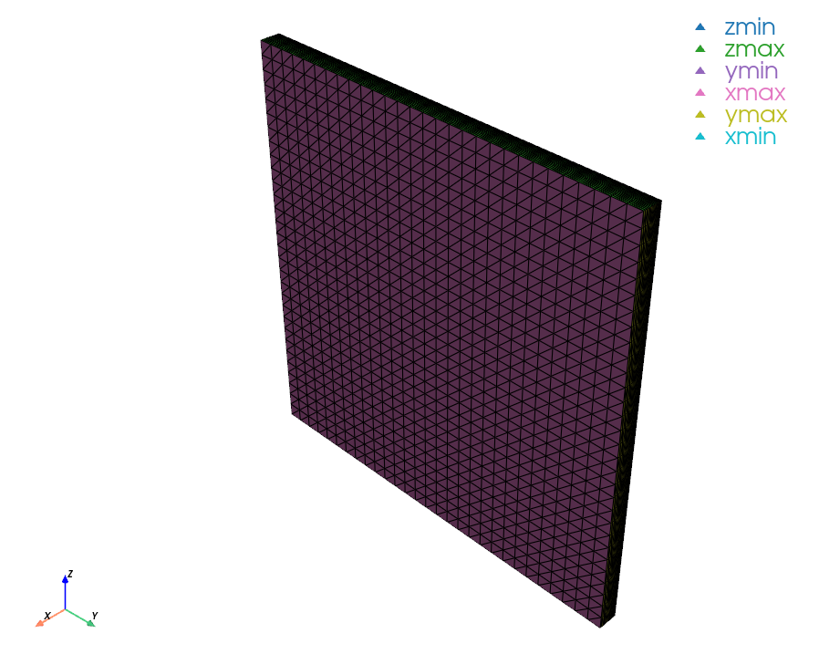
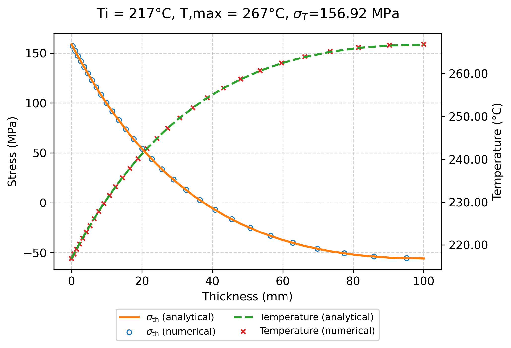

Examples
========

This section documents a reference example case distributed with Z3ST.
Each example corresponds to a fully reproducible simulation located in the
``z3st/examples`` directory of the repository.

Thin slab
---------

Location
^^^^^^^^

`z3st/examples/thin_thermal_slab_adiabatic <https://github.com/giozu/z3st/tree/main/z3st/examples/thin_thermal_slab_adiabatic>`_

Description
^^^^^^^^^^^

This example solves a steady-state **thermo-mechanical** problem in a thin slab.
It is intended as a **verification and reference case** for the coupled
thermal and mechanical solvers and for the associated convergence behaviour.

The example demonstrates:

- YAML-based configuration of geometry and boundary conditions;

- coupled thermo-mechanical simulation;

- mesh visualization;

- post-processing of temperature and displacement-related fields with mesh overlay.

How to run
^^^^^^^^^^

.. code-block:: bash

   cd z3st/examples/thin_thermal_slab_adiabatic
   ./Allrun

Mesh and geometry
~~~~~~~~~~~~~~~~~

.. _fig-slab-mesh:

.. figure:: images/thin_slab/mesh.png
   :width: 70%
   :align: center

   Finite-element mesh of the thin slab example (``mesh.geo`` and ``mesh.msh``).

An additional mesh rendering used for documentation and debugging purposes is
shown in :numref:`fig-slab-mesh-example`, obtained with

.. code-block:: bash

   python3 -m z3st --mesh_plot

.. _fig-slab-mesh-example:

   Alternative view of the computational mesh.

Convergence behaviour
~~~~~~~~~~~~~~~~~~~~~

.. _fig-slab-convergence:

.. figure:: images/thin_slab/convergence.png
   :width: 70%
   :align: center

   Convergence behaviour of the coupled thermal and mechanical solvers.

Temperature field
~~~~~~~~~~~~~~~~~

.. _fig-slab-temperature:

.. figure:: images/thin_slab/temperature_with_mesh.png
   :width: 85%
   :align: center

   Temperature field overlaid with the finite-element mesh.

Displacement field
~~~~~~~~~~~~~~~~~~

.. _fig-slab-displacement:

.. figure:: images/thin_slab/displacement_norm_with_mesh.png
   :width: 85%
   :align: center

   Displacement norm visualized on the deformed configuration with mesh overlay.

Combined fields
~~~~~~~~~~~~~~~

.. _fig-slab-stress-temperature:

   Combined visualization of temperature and stress-related quantities for the thin slab example.

In this post-processing step, the numerical temperature and stress fields are
extracted along the :math:`x` direction at a fixed section of the domain,
corresponding to the mid-planes :math:`y = L_y/2` and :math:`z = L_z/2`,
within a prescribed spatial tolerance.
The resulting one-dimensional profiles are then **compared against analytical
solutions** for both the temperature distribution and the associated thermal
stress, providing a quantitative verification of the thermo-mechanical response.
