Examples
========

This section documents reference examples and verification cases included with Z3ST.
Each example corresponds to a fully reproducible simulation located in the
``z3st/cases`` directory of the repository.

All cases include:

- Complete YAML configuration files
- Mesh generation scripts
- Non-regression testing
- Visualization and post-processing scripts

Linear thermo-mechanics
-----------------------

Thin Slab: Thermo-Mechanical Coupling
^^^^^^^^^^^^^^^^^^^^^^^^^^^^^^^^^^^^^^

.. **Case Directory:** ``cases/verification/thermal/thin_slab_neumann_3D``

This example demonstrates coupled thermo-mechanical analysis of a thin slab subjected to thermal loading.
The case serves as a **verification benchmark** for:

- Thermal conduction with Neumann boundary conditions
- Thermal expansion and stress development
- Coupled staggered solution scheme

**Geometry and Loading:**

- Slab dimensions: :math:`L_x \times L_y \times L_z` = 0.1 × 2.0 × 2.0 m
- Material: Vessel steel (linear elastic, isotropic)
- Thermal BC: Heat flux on one face, fixed temperature on opposite face
- Mechanical BC: Clamped to prevent rigid body motion

**Mesh:**

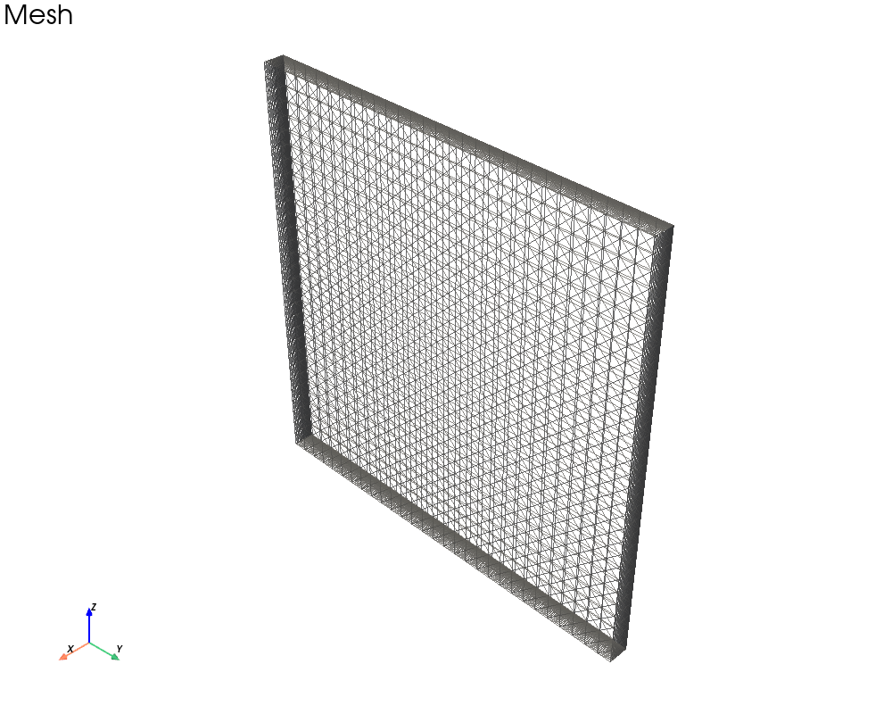

   Finite element mesh of the thin slab (hexahedral elements).

**Convergence:**

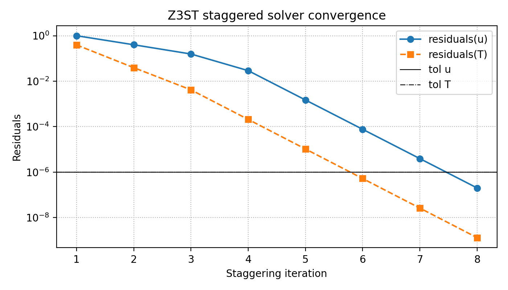

   Staggered solver convergence history showing thermal and mechanical iterations.

**Results:**

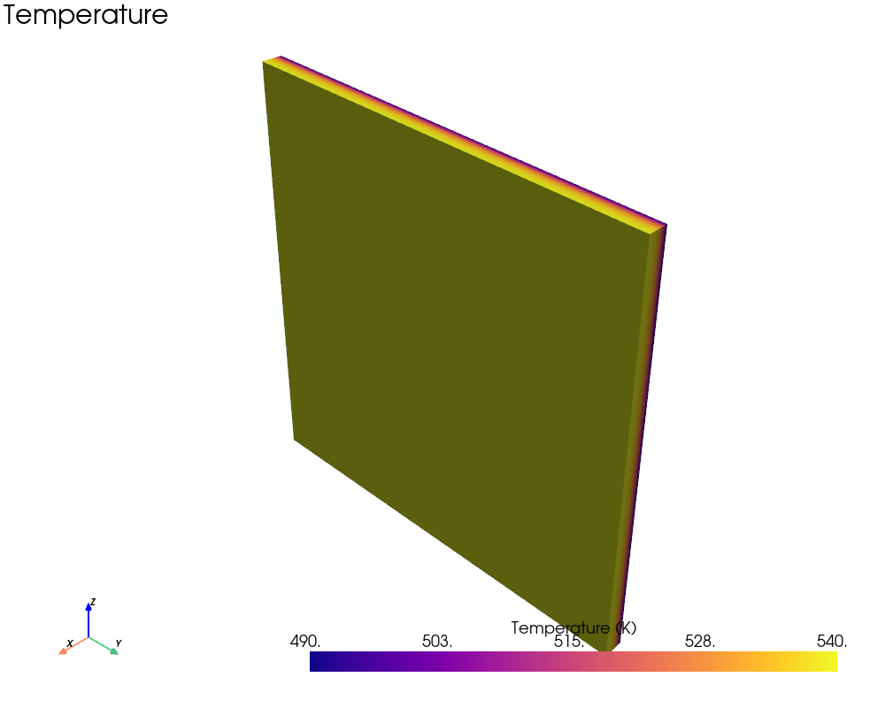

   Temperature distribution (K) with mesh overlay.

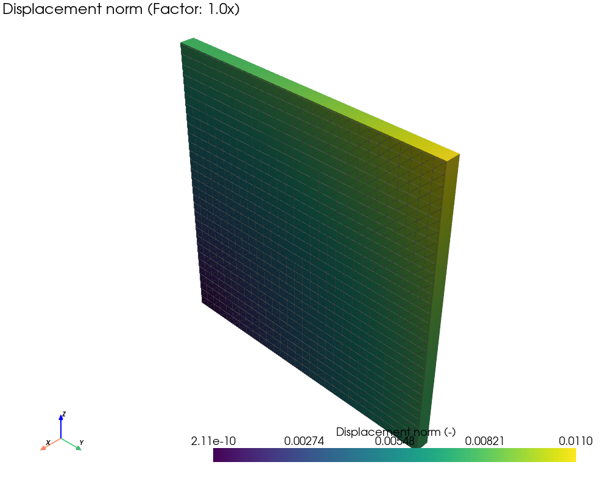

   Displacement magnitude (m) showing thermal expansion.

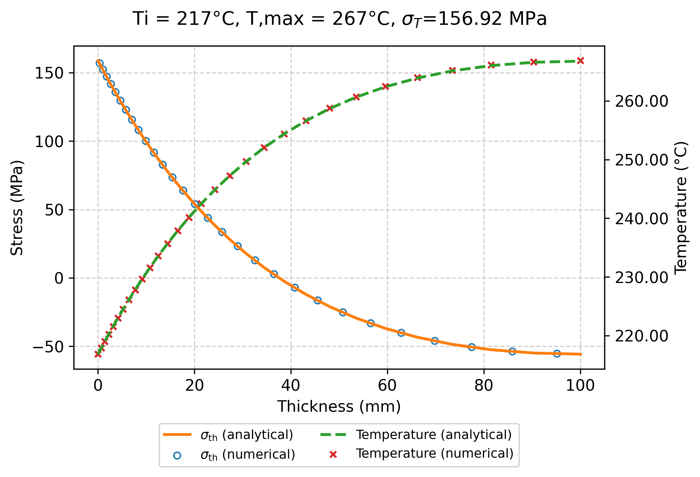

   Combined view: Temperature field and resulting stress distribution.

Cylindrical Shell: Lamé Solution Verification
^^^^^^^^^^^^^^^^^^^^^^^^^^^^^^^^^^^^^^^^^^^^^^

.. **Case Directory:** ``cases/verification/thermal/thick_cylindrical_shell_adiabatic_2D``

This example verifies the mechanical solver against the **analytical Lamé solution** for a thick-walled cylindrical shell under internal pressure.

**Geometry and Loading:**

- Inner radius: :math:`R_i`
- Outer radius: :math:`R_o`
- Internal pressure: :math:`P_i`
- Plane-strain conditions: :math:`\varepsilon_z = 0`

**Mesh:**

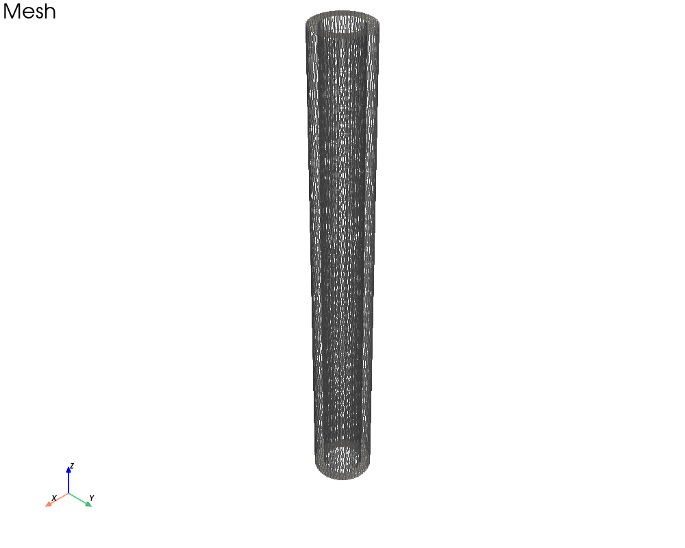

   Axisymmetric mesh for the cylindrical shell.

**Convergence:**

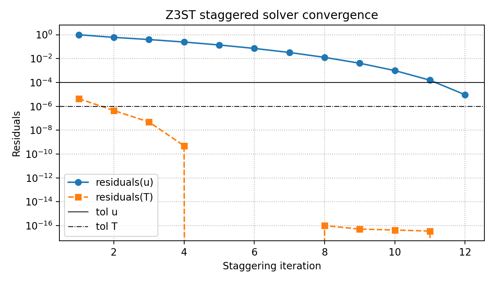

   Solution convergence (single iteration - linear elasticity).

**Results:**

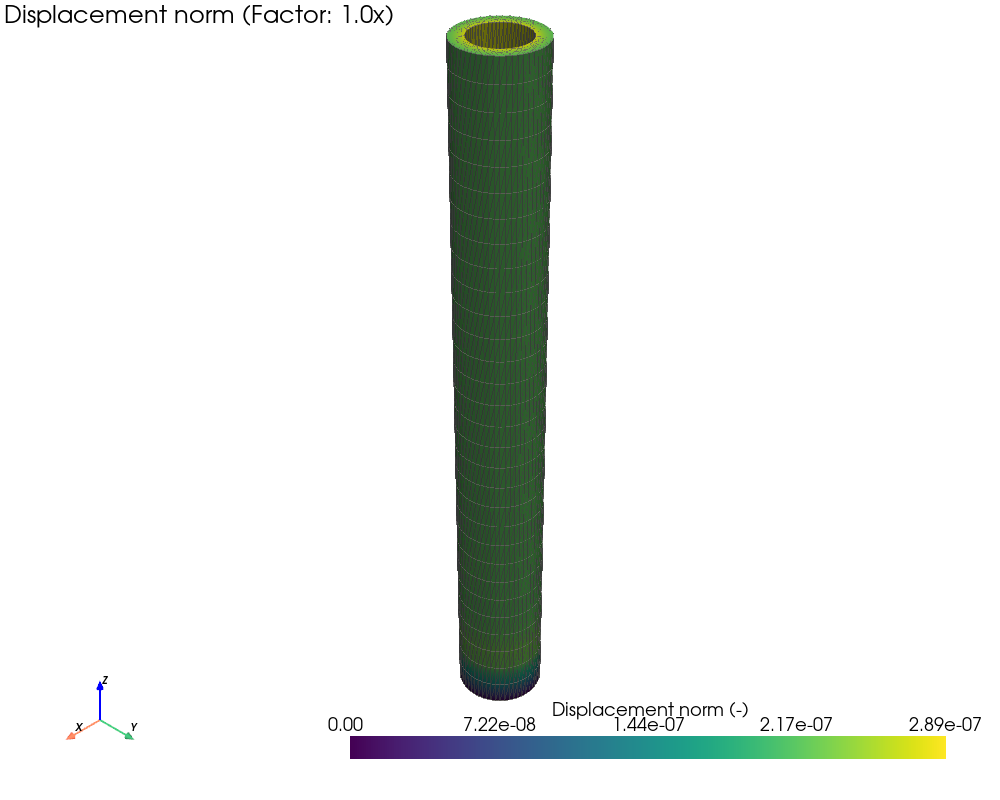

   Radial displacement field showing pressure-induced deformation.

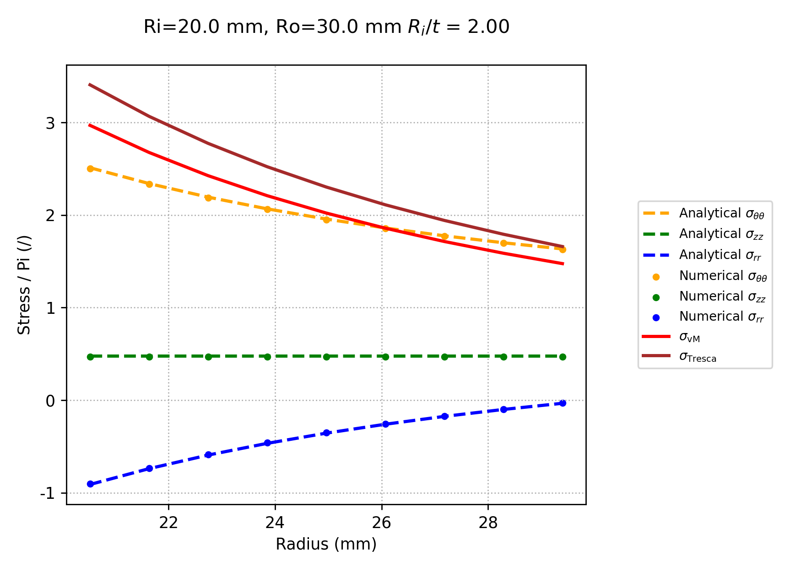

   Comparison of numerical (Z3ST) vs. analytical (Lamé) stress components: radial, hoop, and axial stresses.

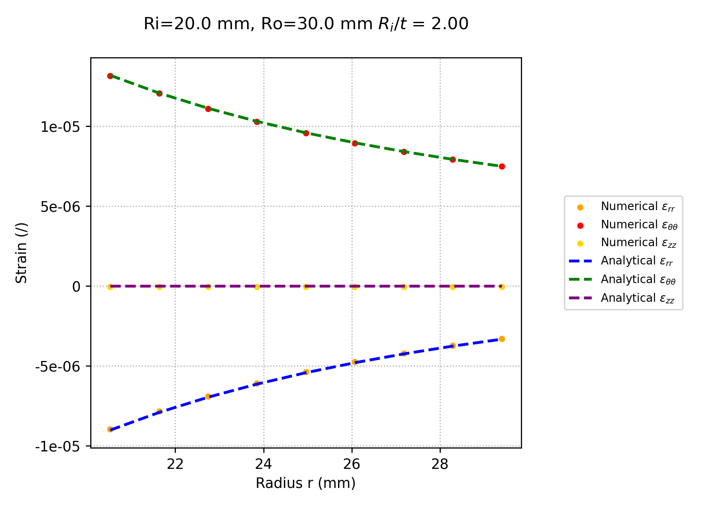

   Strain components compared with analytical solution.

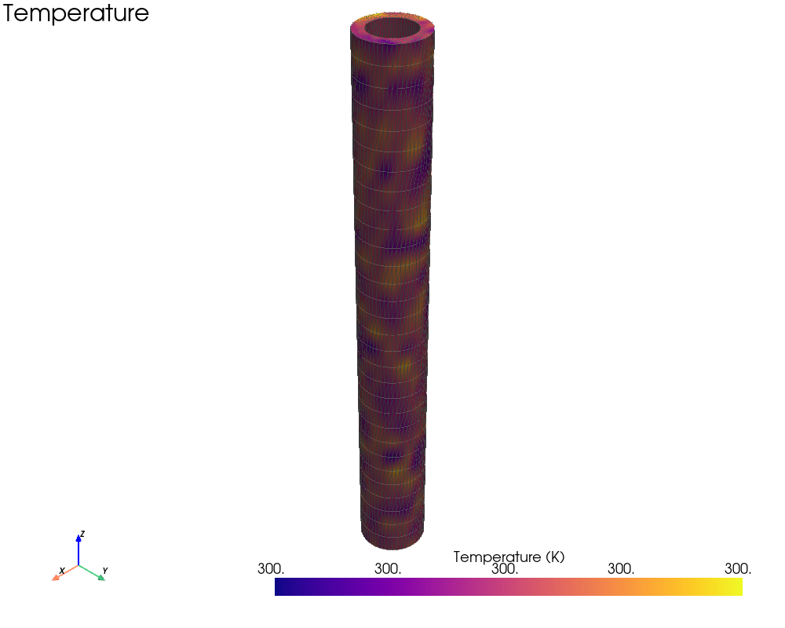

   Temperature distribution for coupled thermo-mechanical analysis variant.

**Verification:**

This case demonstrates:

Agreement with Lamé solution
Correct stress state in cylindrical coordinates
Proper enforcement of plane-strain conditions

Plasticity and Material Nonlinearity
-------------------------------------

J2 Plasticity: Stress-Strain Curve
^^^^^^^^^^^^^^^^^^^^^^^^^^^^^^^^^^^

**Case Directory:** ``cases/verification/plasticity/j2_hardening_2D``

This example demonstrates **J2 (von Mises) plasticity** with isotropic hardening in a 2D plane-strain setting.

**Material Model:**

- Elastic regime: :math:`E = 200\,\mathrm{GPa}`, :math:`\nu = 0.3`
- Yield stress: :math:`\sigma_y = 400\,\mathrm{MPa}`
- Hardening: Isotropic (linear or nonlinear)

**Loading:**

- Uniaxial tension in 2D
- Displacement-controlled loading
- Incremental strain application

**Results:**

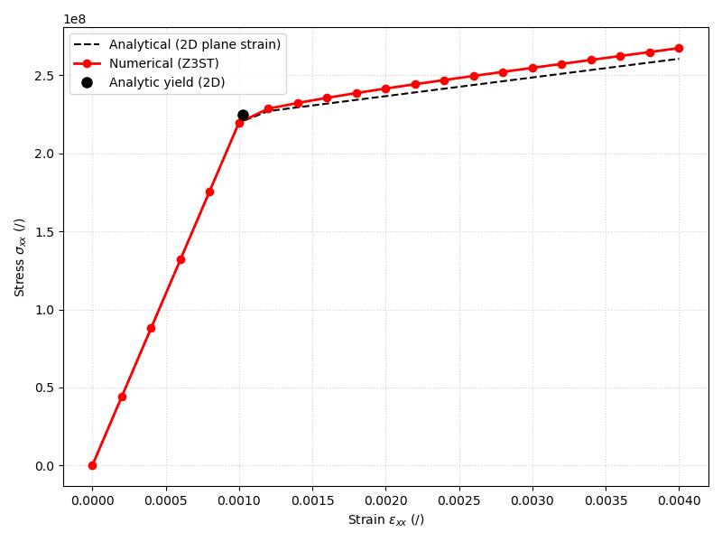

   Stress-strain curve showing elastic regime, yield point, and plastic hardening.

**Physical Behavior:**

1. **Elastic loading** (:math:`0 \to \sigma_y`): Linear response
2. **Yielding** at :math:`\sigma = \sigma_y`: Deviation from linearity
3. **Plastic flow** with hardening: Continued load bearing beyond yield
4. **Strain accumulation**: Permanent plastic deformation

Crystal Plasticity with Automatic Differentiation
^^^^^^^^^^^^^^^^^^^^^^^^^^^^^^^^^^^^^^^^^^^^^^^^^^

**Case Directory:** ``cases/verification/plasticity/crystal_single_grain``

This advanced example demonstrates **single crystal plasticity** using **automatic differentiation** via UFL for exact Jacobian computation.

**Physical Model:**

- FCC crystal structure
- Active slip system: (111)[0-11]
- Schmid factor: :math:`\mu = 0.408`
- Power-law viscoplasticity: :math:`\dot{\gamma} = \gamma_0 |\tau/g_0|^n \text{sign}(\tau)`

**Material Parameters:**

- :math:`E = 200\,\mathrm{GPa}`
- :math:`\nu = 0.3`
- Reference slip rate: :math:`\dot{\gamma}_0 = 0.001\,\mathrm{s}^{-1}`
- Critical resolved shear stress: :math:`g_0 = 200\,\mathrm{MPa}`
- Power law exponent: :math:`n = 5`

**Loading:**

- Uniaxial tension along z-axis
- 21 displacement steps to 0.5% strain
- Strain rate: :math:`0.005\,\mathrm{s}^{-1}`

**Results:**

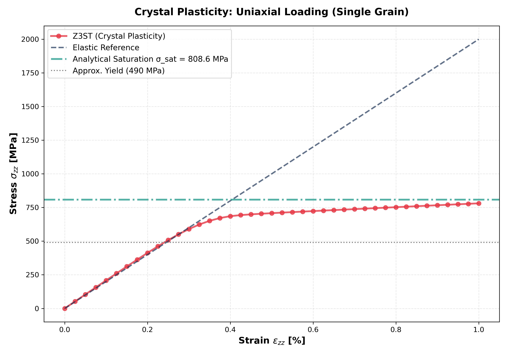

   Crystal plasticity stress-strain curve showing elastic response, yielding (:math:`\tau = g_0`), and viscoplastic flow approaching saturation stress.

**Key Features:**

**Automatic differentiation**: UFL computes exact Jacobian symbolically
**Newton convergence**: 2 iterations per step (quadratic convergence)
**Semi-analytical verification**: Saturation stress :math:`\sigma_{sat} = 808.6\,\mathrm{MPa}` (error: 12.5%)
**History variables**: Backward Euler integration with plastic strain accumulation

**Implementation Highlight:**

The model uses UFL's ``ufl.variable()`` and ``ufl.diff()`` to automatically compute:

.. math::

   \frac{\partial \dot{\gamma}}{\partial \tau} = \frac{n \gamma_0}{g_0} \left(\frac{\tau}{g_0}\right)^{n-1}

This eliminates **hundreds of lines** of error-prone manual derivative code!

Stress-Strain Curves: Displacement-Controlled Loading
^^^^^^^^^^^^^^^^^^^^^^^^^^^^^^^^^^^^^^^^^^^^^^^^^^^^^^

**Case Directory:** ``cases/verification/plasticity/stress_strain_displacement``

This example generates stress-strain curves under **displacement-controlled** loading, useful for:

- Material characterization
- Calibration of constitutive models
- Validation against experimental data

**Results:**

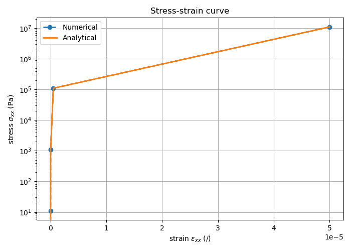

   Stress-strain response under displacement control.

**Applications:**

- Tensile testing simulation
- Compression testing
- Cyclic loading (with appropriate modifications)

Phase-Field Fracture
--------------------

Box with Initial Crack (2D)
^^^^^^^^^^^^^^^^^^^^^^^^^^^^

**Case Directory:** ``cases/regression/box_crack_2D``

This example demonstrates **phase-field fracture** using the AT2 model. The simulation captures:

- Crack initiation from pre-existing defect
- Crack propagation under tension
- Damage evolution and stress redistribution

**Model:**

- AT2 phase-field model
- Characteristic length: :math:`\ell_c = 0.002\,\mathrm{m}`
- Critical energy release rate: :math:`G_c`
- Degradation function: :math:`g(D) = (1-D)^2 + k_{res}`

**Results:**

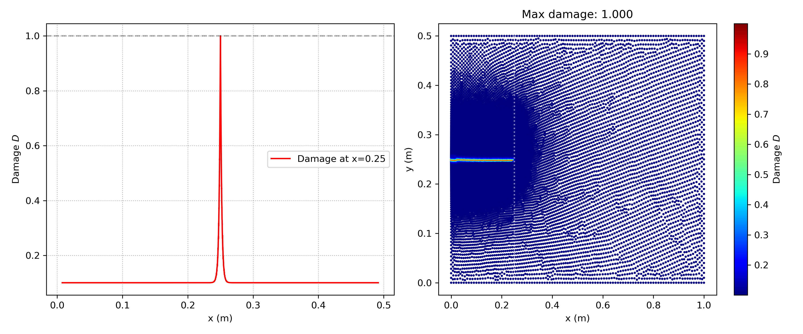

   Damage field evolution showing crack propagation (:math:`D = 0`: intact, :math:`D = 1`: fully damaged).

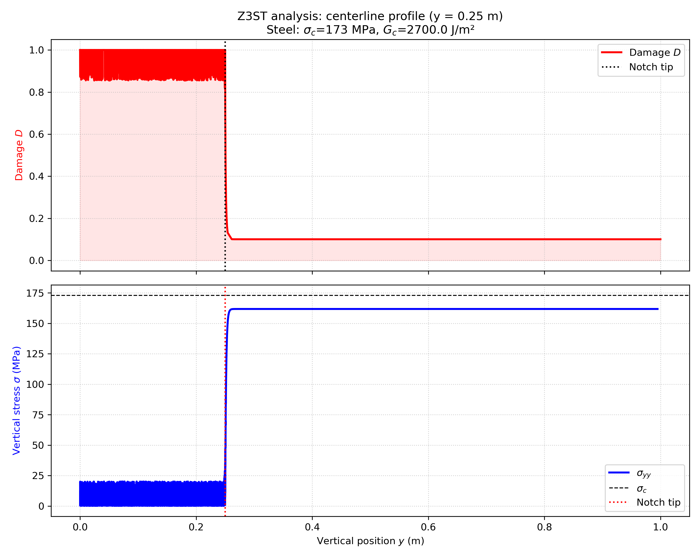

   Damage and stress profiles along crack path showing stress concentration and release.

**Physical Behavior:**

1. **Initial state**: Pre-cracked geometry with :math:`D = 1` in notch
2. **Loading**: Tensile displacement applied incrementally
3. **Crack growth**: Damage field D evolves from crack tip
4. **Stress release**: Stresses drop behind advancing crack front
5. **Energy balance**: Elastic energy → surface energy conversion

**Key Features:**

**No remeshing required**: Phase-field regularizes sharp crack
**Complex crack paths**: Handles branching and merging
**Thermodynamically consistent**: Variational formulation
**Irreversibility**: Damage can only increase

Single-Edge-Notched Shear Test (Miehe 2010 benchmark)
^^^^^^^^^^^^^^^^^^^^^^^^^^^^^^^^^^^^^^^^^^^^^^^^^^^^^^^

**Case Directory:** ``cases/benchmarks/sen_shear``

A standard phase-field-fracture benchmark: a square specimen with a horizontal
pre-notch is loaded in shear. The curved crack path that develops reproduces the
result of Miehe et al., *Comput. Methods Appl. Mech. Engrg.* 199 (2010)
2765--2778 -- the foundational phase-field paper.

**Setup:**

- Coupled mechanics + phase-field damage (steel)
- Horizontal pre-notch on the left edge
- Imposed horizontal displacement :math:`u_x = 15\,\mu\mathrm{m}`

**Results:**

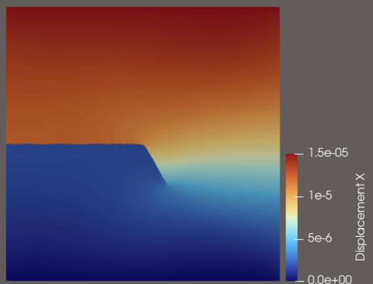

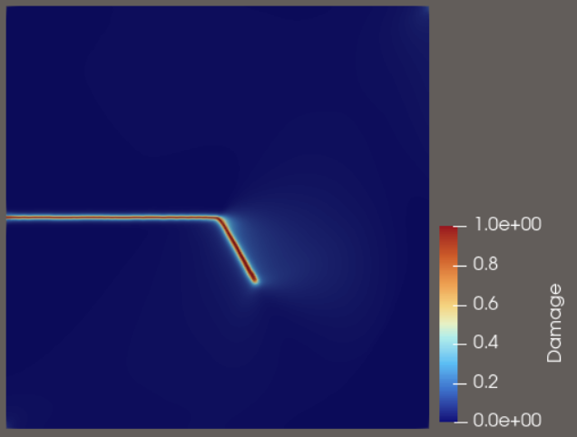

   Imposed shear displacement (left) and the resulting curved crack path (right).

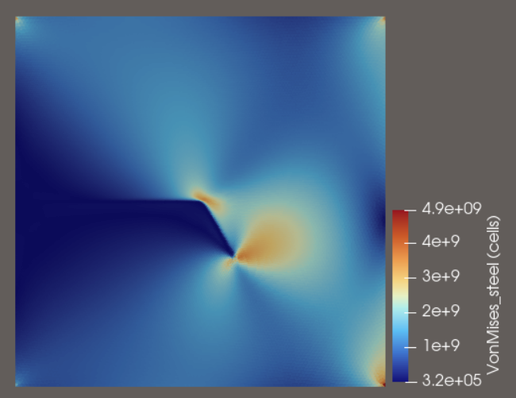

   Von Mises stress concentration at the propagating crack tip.

UO\ :sub:`2` Pellet Thermal-Shock Cracking (McClenny 2022)
^^^^^^^^^^^^^^^^^^^^^^^^^^^^^^^^^^^^^^^^^^^^^^^^^^^^^^^^^^^^

**Case Directory:** ``cases/benchmarks/pellet_quench_2D_xy``

The fully coupled showpiece, in which thermal, mechanical, and phase-field damage
all meet. A 2D plane-strain transverse cross-section of a UO\ :sub:`2` pellet has
a cold-contact wedge on its rim; the tensile hoop-stress ring drives discrete
radial cracks. It reproduces McClenny et al., *J. Nucl. Mater.* 565 (2022).

**Model:**

- AT1 crack density + Amor split + Ambati hybrid constraint
- Fully coupled :math:`T \to \boldsymbol{\varepsilon}_{el} \to D`
- 2D plane-strain half-disc with mirror symmetry

**Results -- fields:**

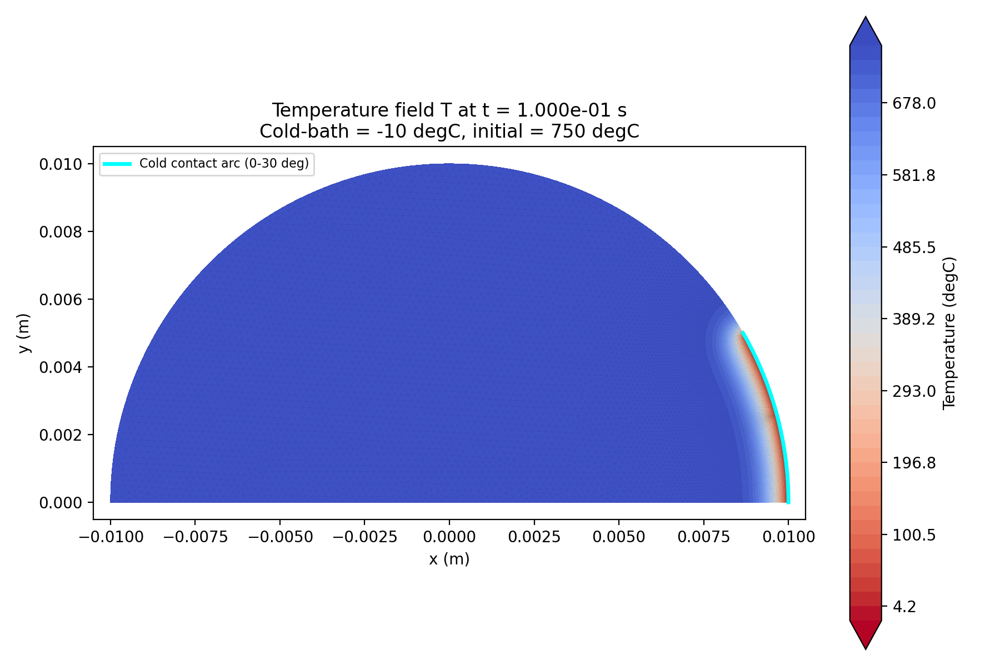

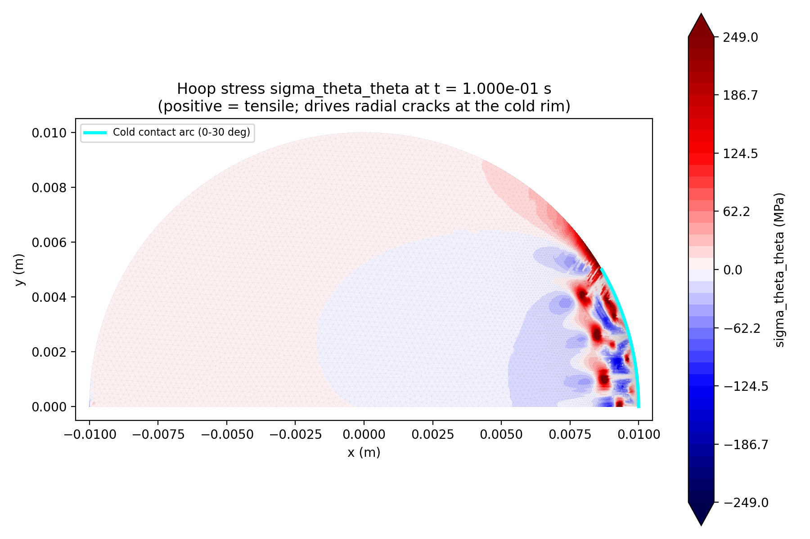

   Cold-contact wedge cools the rim (left); the tensile hoop-stress ring it sets
   up drives the cracking (right).

**Results -- simulation against experiment:**

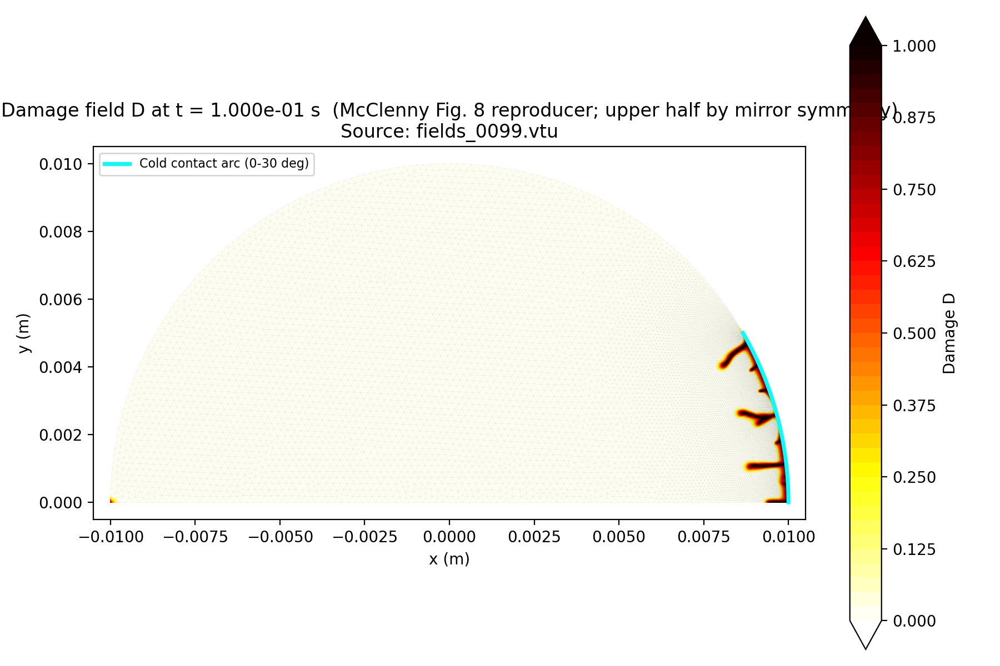

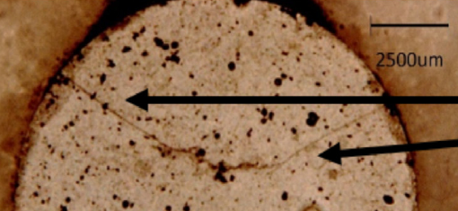

   Simulated damage with discrete radial cracks (left) against a cross-section of
   a real cracked UO\ :sub:`2` pellet (right).

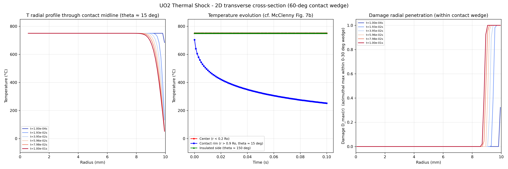

   Quantitative verification: radial temperature profile, temperature history at
   the contact rim, and damage penetration, against McClenny Fig. 7b.

Numerical analysis
------------------

Mesh Convergence Study
^^^^^^^^^^^^^^^^^^^^^^^

**Case Directory:** ``cases/studies/mesh_sensitivity_2D``

This example demonstrates **mesh convergence** for a 2D thermal problem, showing how solution accuracy improves with mesh refinement.

**Setup:**

- 2D rectangular domain with prescribed boundary conditions
- Systematic refinement: :math:`n_x = 10, 20, 40, 80` elements
- Temperature profiles extracted along centerline

**Results:**

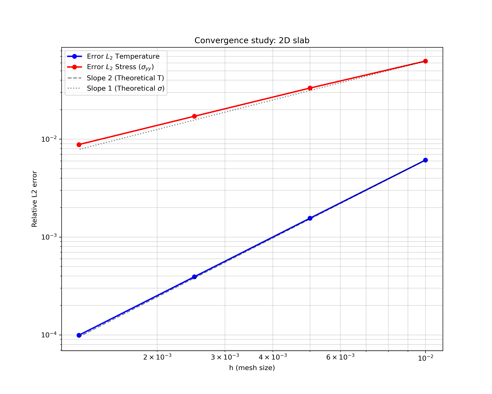

   Convergence plot showing error vs. mesh size (log-log scale).

**Temperature Profiles at Different Mesh Resolutions:**

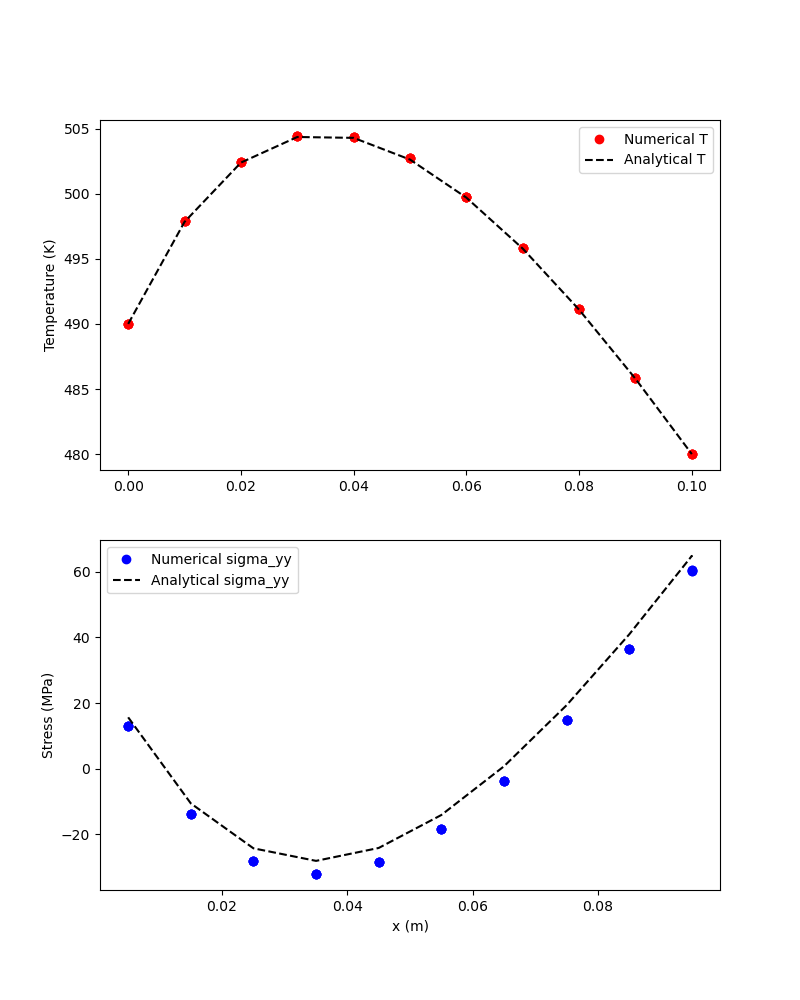

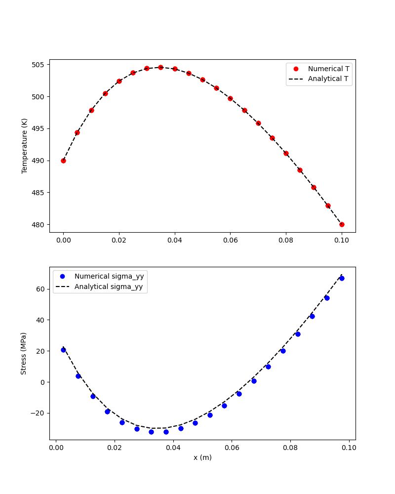

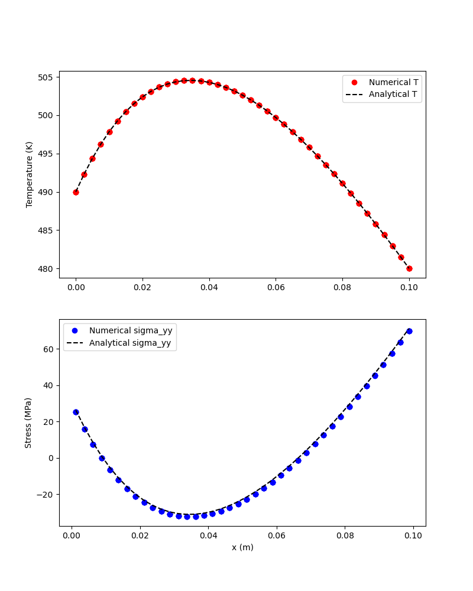

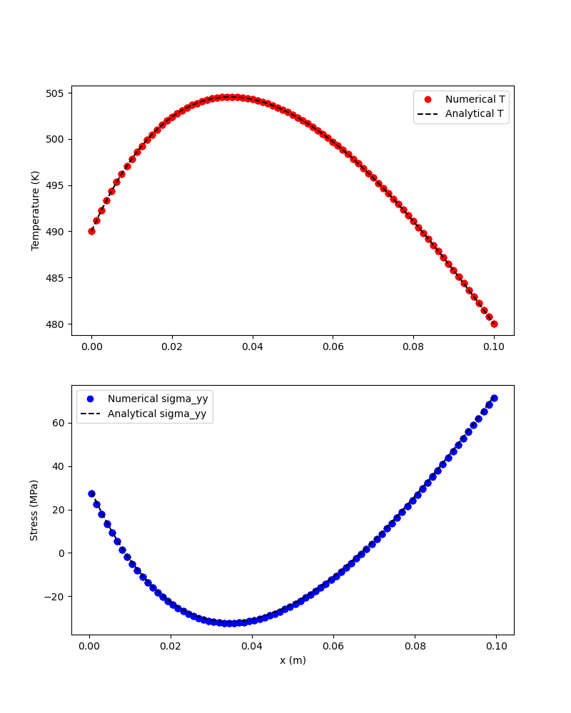

   Temperature profiles for nx = 10, 20, 40, 80 (left to right, top to bottom).

**Key Findings:**

- Convergence rate: :math:`\mathcal{O}(h^2)` for P1 elements
- Fine mesh (nx=80) achieves < 0.5% error
- Demonstrates importance of mesh refinement for accurate results
