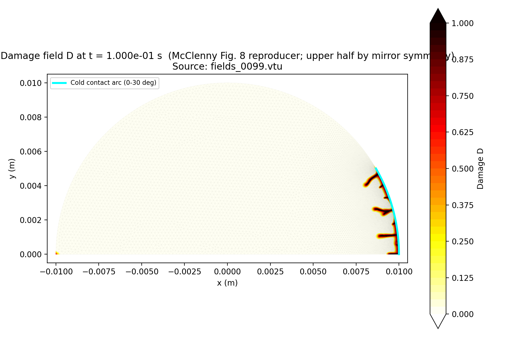
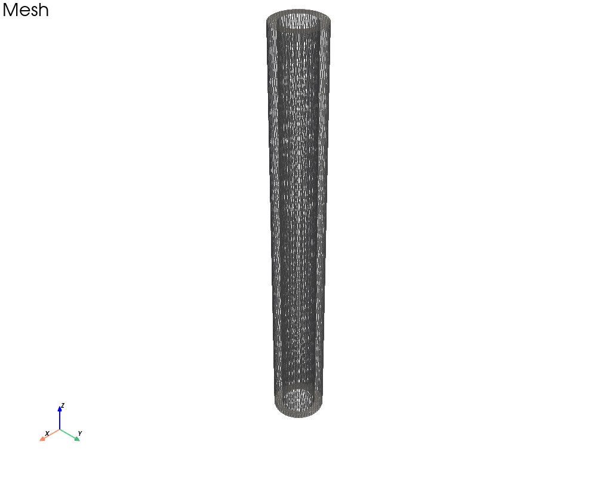
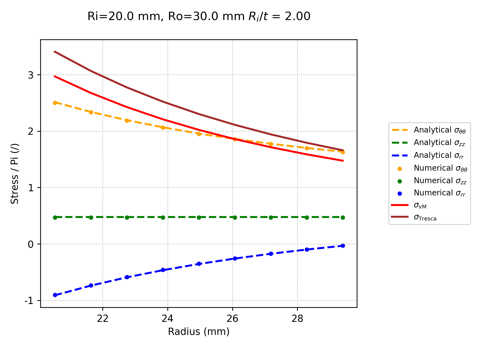
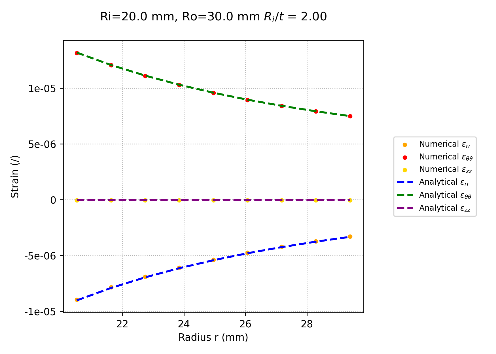
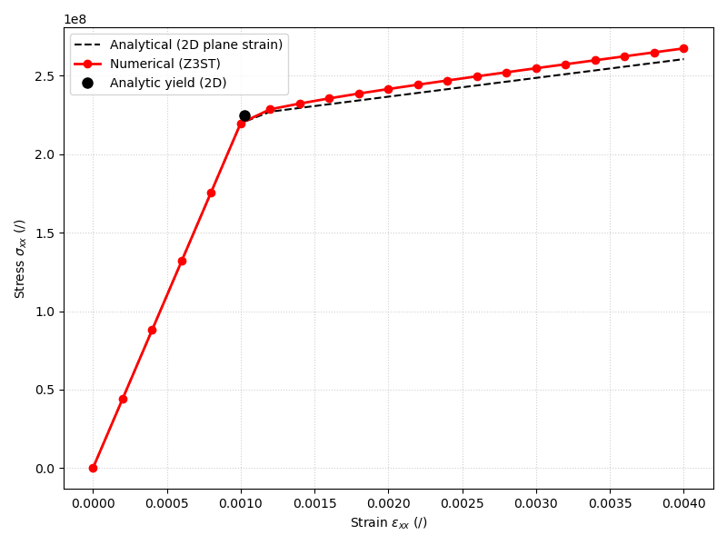
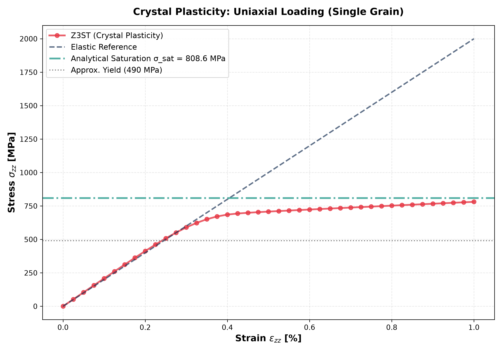
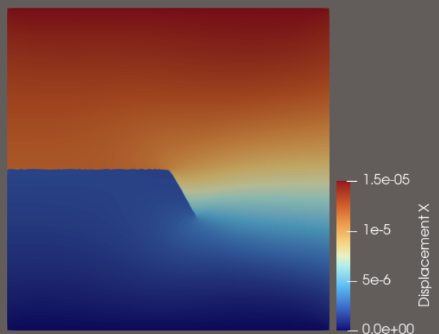
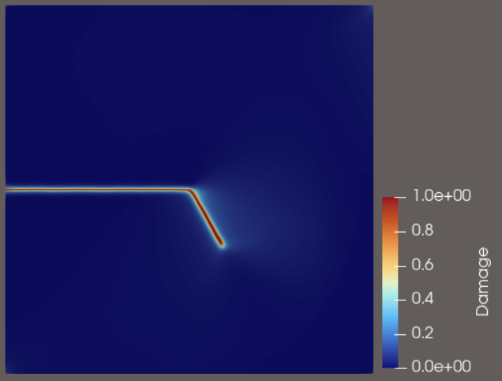

Examples
========

Each example is a case directory under ``z3st/cases/`` (or ``z3st/examples/``)
that runs with ``./Allrun``: Gmsh builds the mesh, ``python -m z3st`` solves,
and ``non-regression.py`` writes ``output/non-regression.json``. Paths below
are relative to ``z3st/cases/`` unless stated otherwise. The errors of the
cases with an analytical reference are collected in :doc:`verification`.

The material cards used by these cases hold representative values chosen for
demonstration and verification (see ``z3st/materials/README.md``).

Cases of the software paper
---------------------------

These four cases are Section 3 of the software paper. Their geometries, power
histories and loads are chosen for illustration and do not correspond to a
specific irradiated rod or experiment.

Fuel rod segment
^^^^^^^^^^^^^^^^

``regression/pwr_rod_2D``. An axisymmetric 10 mm segment of a light-water
reactor rod: UO\ :sub:`2` pellet of radius 4.5 mm, Zircaloy-4 cladding from
4.565 to 5.315 mm (as-fabricated gap 65 µm), 20 kW/m over 1800 days, 900 Q1
cells. Active models: heat conduction with gas gap conductance, solid and
gaseous swelling with densification, isotropic cracking, penalty contact,
cladding thermal and irradiation creep. In the run reported in the paper the
gap closes at 14.6 MWd/kgU (457 days), the contact pressure levels off at
21.7 MPa, and the peak fuel temperature is 1057 K at the end of the power ramp
and 925 K after gap closure.

Check: the fuel-average burnup against the time integral of the power divided
by the heavy-metal mass (relative difference 4.3e-8 in the paper). The other
metrics are protected by the gold only. The case carries a gold but is listed
in ``suite_exclude.txt`` and is run by hand. ``regression/fg_test_2D`` is the
same rod with gaseous swelling and fission gas release computed by SCIANTIX.

Quenched pellet (test case)
^^^^^^^^^^^^^^^^^^^^^^^^^^^

``benchmarks/damage/pellet_quench_2D_xy``. A test case for the phase-field
module on a thermal transient. Its configuration is taken from the quench
study of McClenny et al. (*J. Nucl. Mater.* 565 (2022)), but the simulation
does not reproduce that experiment: the initial temperature (1023 K) is above
the range of the tests, the contact arc is derived from a surface fraction,
and the regularisation length (50 µm) is 50 times the one of their model.

Setup: plane-strain upper half-disc of radius 10 mm with mirror symmetry on
:math:`y = 0`, uniform initial temperature 1023 K, 263 K imposed on a 60° arc
of the perimeter, the rest adiabatic. AT1 with the volumetric-deviatoric (Amor)
split and the hybrid constraint, :math:`\ell = 50` µm,
:math:`\sigma_c = 1` GPa, mesh size 12.5 µm along the cold arc, 100 steps to
0.1 s. The phase field starts at zero, with no pre-crack.

Check: regression against the gold on the final mean temperature, the maximum
of the phase field and the number of cracks with :math:`D > 0.5`. There is no
reference for the crack pattern.

   Phase field at :math:`t = 0.1` s in the modelled half-disc. The cyan line
   is the modelled half of the cold arc.

Porosity migration
^^^^^^^^^^^^^^^^^^

``verification/fuel/porosity_migration`` and
``verification/fuel/porosity_migration_dg``. A 22.5° sector of a
(U,Pu)O\ :sub:`2` pellet of outer radius 2.675 mm, initial porosity 0.15,
500 W/cm, outer surface ramped from 623 to 1300 K over 10\ :sup:`4` s,
no mechanics. Pores are advected with the velocity of Barani et al.
(after Sens), and porosity feeds back on the conductivity (Kato with
Maxwell-Eucken) and on the heat source. ``porosity_migration`` uses the
streamline-upwind continuous scheme, ``porosity_migration_dg`` the upwind
discontinuous-Galerkin scheme with SSP-RK3 time stepping and a vertex limiter.

Result reported in the paper: a central void of radius 0.16 :math:`R_o` with
both schemes, against about 0.2 :math:`R_o` reported by Barani et al., and
centre temperatures of 2949.1 K (CG) and 2986.0 K (DG). Check: regression
against the gold.

Three-dimensional shrink fit
^^^^^^^^^^^^^^^^^^^^^^^^^^^^

``verification/fuel/shrink_fit_disk_3d``. A quarter of a solid disc of radius
4.10 mm inside a ring of radii 4.13 and 4.75 mm, 1 mm thick, initial gap
30 µm. The disc surface is ramped from 300 to 1500 K in 7 steps, closes the gap
by thermal expansion and loads the ring through penalty contact
(:math:`k_\mathrm{pen} = 10^{15}` Pa/m). P1 temperature, P2 displacement.

Check: contact pressure against the plane-stress Lamé interference pressure.
The mesh study and its floor of about 0.35 %, set by the penalty, are described
in :doc:`verification`.

Thermo-mechanics
----------------

Thick-walled cylinder under pressure
^^^^^^^^^^^^^^^^^^^^^^^^^^^^^^^^^^^^

``z3st/examples/cylindrical_shell`` (path relative to the repository root).
Axisymmetric steel cylinder, inner radius 20 mm, outer radius 30 mm, height
0.5 m, internal pressure 1 MPa, outer surface free, uniform temperature. The
top face carries an imposed axial displacement, so the axial strain is uniform
(generalised plane strain). Check: radial, hoop and axial stress and strain
against the Lamé solution in generalised plane strain, tolerance 5e-3.

   Mesh of the cylinder cross-section.

   Stresses normalised by the internal pressure, Z3ST against the Lamé
   solution.

   Strains, Z3ST against the Lamé solution.

Slabs, shells and the heated box
^^^^^^^^^^^^^^^^^^^^^^^^^^^^^^^^

``verification/thermal/`` holds slabs (``thin_slab_*``, ``thick_slab_*``),
thin and thick cylindrical shells (``thin_cylindrical_shell_*``,
``thick_cylindrical_shell_*``) and a heated box (``box_heated``), with
Dirichlet, Neumann, Robin (non-adiabatic) or adiabatic conditions and gamma
heating. Each is checked against the analytical temperature profile and, where
mechanics is active, the thermal stresses. For example,
``verification/thermal/thin_slab_neumann_3D`` is a 0.1 × 2 × 2 m steel slab
with an outgoing flux of 4810 W/m\ :sup:`2` on one face and 583 K on the
opposite face. ``verification/thermal/spherical_shell`` is the
three-dimensional gamma-heated sphere described in :doc:`verification`.

``verification/mechanics/`` holds the elastic cases: Lamé cylinders in plane
strain and generalised plane strain (``lame_*``), the Mariotte thin shell,
annular and full cylinders, spherical and elliptical cavities, imposed thermal
gradients in 2D and 3D, and uniaxial tension (``uniaxial_tension`` and the
Neo-Hookean ``uniaxial_tension_nonlinear``).

``verification/mechanics/stress_strain_displacement`` and
``verification/mechanics/stress_strain_stress`` load a linear-elastic 2D
plane-strain block in 5 steps, with an imposed displacement or an imposed
traction. ``stress_strain_displacement`` compares :math:`\sigma_{xx}` with
:math:`E\varepsilon_{xx}/(1-\nu^2)`.

Plasticity
----------

J2 plasticity with linear hardening
^^^^^^^^^^^^^^^^^^^^^^^^^^^^^^^^^^^

``verification/plasticity/j2_hardening_2D``. A 2D plane-strain steel block
pulled by an imposed displacement in 21 steps up to 0.4 mm. Material
``z3st/materials/steel.yaml``: :math:`E = 200` GPa, :math:`\nu = 0.3`,
``yield_strength`` 200 MPa, ``hardening_modulus`` 10 GPa. The plasticity
model implements linear isotropic hardening only. Check: :math:`\sigma_{xx}`
at each step against the closed-form plane-strain response.

   Stress-strain curve of the case against the closed form.

Single-crystal plasticity through a user stress function
^^^^^^^^^^^^^^^^^^^^^^^^^^^^^^^^^^^^^^^^^^^^^^^^^^^^^^^^

``verification/plasticity/crystal_single_grain``. A 3D single grain in
uniaxial tension along :math:`z` to 1 % strain in 41 steps. The material card
sets ``constitutive: custom`` and names the stress function
``single_crystal_law.single_crystal_stress``, a case-local Python module: one
FCC slip system (111)[0-11], Schmid factor 0.408, power-law slip rate with
:math:`\dot\gamma_0 = 10^{-3}` s\ :sup:`-1`, :math:`g_0 = 200` MPa,
:math:`n = 5`, backward Euler. The residual is solved by Newton's method in
PETSc SNES with the Jacobian generated by UFL. Check: the final stress against
the analytical saturation stress 808.6 MPa (3.4 % in the gold, tolerance
25 %).

   Axial stress against axial strain, with the elastic line and the saturation
   stress.

Phase-field fracture
--------------------

Single-edge-notched shear (SENS)
^^^^^^^^^^^^^^^^^^^^^^^^^^^^^^^^

``benchmarks/damage/sen_shear``. The SENS configuration of Ambati et al.
(*Comput. Mech.* 55 (2015) 383-405): a 1 × 1 mm plane-strain plate with a
horizontal notch from the left edge to the centre, held as a slit with
:math:`D = 1` imposed on it. Bottom edge clamped, top edge displaced
horizontally with :math:`u_y = 0`. The ramp is generated by ``bc_generator.py``
in 796 steps up to 30 µm: 1 µm increments to 5 µm, 0.2 µm to 8 µm, 0.01 µm to
15 µm and 0.2 µm to 30 µm. AT2 with the star-convex split
(``gamma_star: 5.0``) and the hybrid constraint, :math:`\ell = 4` µm,
high-carbon steel card (:math:`E = 210` GPa, :math:`\nu = 0.3`,
:math:`G_c = 2700` J/m\ :sup:`2`). ``sweep_gamma.sh`` reruns the case for
``gamma_star`` 0, 1 and 5.

The case carries a gold but is excluded from the local suite (about 2 h).
``benchmarks/damage/sen_tension`` is the tension counterpart, also excluded.

   Horizontal displacement and phase field from a run of the case, at an
   imposed displacement of 15 µm (colour bar of the left panel).

Two elliptical cavities
^^^^^^^^^^^^^^^^^^^^^^^

``regression/two_elliptical_cavities_2D``. A 2D plate with two elliptical
cavities and phase-field damage, protected by its gold. It is the phase-field
case of the CI list.

Fuel behaviour
--------------

Each of these is a single-effect check against a closed form, in
``verification/fuel/``.

- ``shrink_fit``: axisymmetric pellet in a tube, pellet surface ramped from
  300 to 1500 K in 13 steps with no heat generation. Contact pressure against
  the plane-stress Lamé interference pressure.
- ``shrink_fit_disk``: the same check on a 2D plane-strain quarter-disc
  section, against the plane-strain Lamé pressure.
- ``creep``: Norton creep of an axisymmetric bar under constant traction.
  Axial, creep and radial strain against the closed form.
- ``creep_relaxation``: stress relaxation of a bar at constant total strain,
  against the scalar backward-Euler recursion and the exact solution.
- ``creep_irradiation``: irradiation creep :math:`\dot\varepsilon = B\phi\sigma`
  on the same bar.
- ``creep_shrink_fit_2D``: contact-pressure relaxation of a shrink fit by
  cladding creep, against the independent radial solution
  ``reference_1d.py`` (see :doc:`verification`).
- ``burnup``: burnup accumulation and a rim-peaking radial power shape on an
  axisymmetric pellet. Mean burnup against the closed form.
- ``swelling``: a free 3D block with a constant volumetric swelling. Zero von
  Mises stress and the free expansion :math:`u_x = (\Delta V/V)L_x/3`.
- ``fuel_swelling``: swelling driven by the burnup field, same checks.
- ``cracking``: the isotropic-softening cracking model, which rescales the
  elastic constants from the number of radial cracks.
- ``axial_power``: chopped-cosine axial power shape. Mean burnup, axial
  peaking factor, end-to-peak ratio, centreline temperature rise and free
  axial elongation against closed forms.
- ``axial_table``: tabulated axial power shape. Mean burnup, ratios at table
  nodes and peak-to-mean ratio.
- ``pellet_heatgen_3D``: 3D heated pellet. Azimuthal scatter of temperature
  and von Mises stress at fixed radius, and in-plane shear stress.
- ``thermal_conductivity/``: MA-MOX conductivity of Magni et al. and its
  Gaussian-process correction, on axisymmetric pellets.

Cluster dynamics
----------------

``verification/cluster/mass_conservation_1D``. 1D transport of a cluster size
distribution, implicit Euler with DG1, upwind interior-facet flux and SIPG
diffusion. The model rescales the distribution after each step so that the
total cluster mass is conserved, so conservation holds by construction and the
case is a regression case: it records the rescale factor, whose largest
per-step correction on the shipped configuration is 3.6 %.

Machine-learned conductivity
----------------------------

- ``verification/thermal/nn_conductivity_slab_2D``: steady conduction in a
  slab with :math:`k = \mathrm{NN}(T)`, a PyTorch network (``knet.pt``) trained
  by ``train_knet.py`` on :math:`k(T) = 1/(a + bT)`. The thermal problem is
  solved by Newton's method through ``dolfinx-external-operator``. Check:
  temperature against the closed-form profile of that law.
- ``studies/magni_gpr_conductivity``: fitting and verification scripts for the
  Gaussian-process correction of the Magni MA-MOX correlation, trained on a
  synthetic residual.
- ``studies/gpr_uq_margin``: a MA-MOX pin at 45 kW/m with surface held at
  650 K, solved for :math:`k = k_\mathrm{Magni}\exp(\bar r + \xi s)` at
  :math:`\xi = -2 \dots 2` posterior standard deviations. ``run.py`` reports the
  centre temperature and the margin to the MOX solidus. In the paper the centre
  temperature goes from 1720.2 to 1707.5 K. The spread is set by the posterior
  of a synthetic fit and is not the uncertainty of a measured correlation. Not
  in the suite.

Inverse problem
---------------

``verification/fuel/creep_law_discovery``. Identifies the creep mechanism of
the ``creep_relaxation`` problem from its own finite-element data (500 steps,
mean axial stress at 51 times, 2 % multiplicative noise). ``discover.py``
fits a library of five candidate laws (:math:`S, S^2, S^3, S^5, \sinh S`)
with a material-point backward-Euler integrator, propagates the parameter
sensitivities by forward-mode automatic differentiation (dual numbers), fits by
Gauss-Newton and eliminates terms by their share of the creep strain. The
stored ``output/discovery.json`` selects the cubic Norton term alone, with a
coefficient within 1.63 % of the true value. Excluded from the local suite
(501 steps). See also :doc:`in_development`.

Mesh convergence
----------------

``studies/mesh_sensitivity_2D`` runs a thermo-elastic slab on four meshes and
writes ``convergence_data.txt``. The results are in :doc:`verification`.

Teaching cases
--------------

``teaching/01_1D`` and ``teaching/01_3D`` are a bar in uniaxial tension on a
1D line mesh (``regime: 1d``) and on a 3D hexahedral mesh. Both are checked
against :math:`u_x(L) = PL/E`. Both carry a gold and are in the local suite.

``teaching/02_tensile_bar_3D`` is a round tensile specimen (d = 10 mm,
L = 50 mm, F = 15 kN, steel) in 3D, a quarter meshed with two symmetry planes.
The stress is uniaxial, so :math:`\sigma_{zz} = F/A`, the strains, the normal
and shear stress on an inclined plane and the Tresca and von Mises stresses
have closed forms. The displacement field is linear, so linear tetrahedra match
them to machine precision.

``teaching/03_plate_with_hole_2D`` is a circular hole in a wide plate under
remote tension, in plane strain, checked against Kirsch's solution: stress
concentration factor within 0.6 % of 3, hoop stress on the hole edge and
:math:`\sigma_{xx}` across the section within 1.8 %.

All four carry a gold and are in the local suite.
The tags ``course-2627.0`` and ``course-2627.1`` mark the releases used in the
course Nuclear Design and Technology at Politecnico di Milano, 2026-27.
