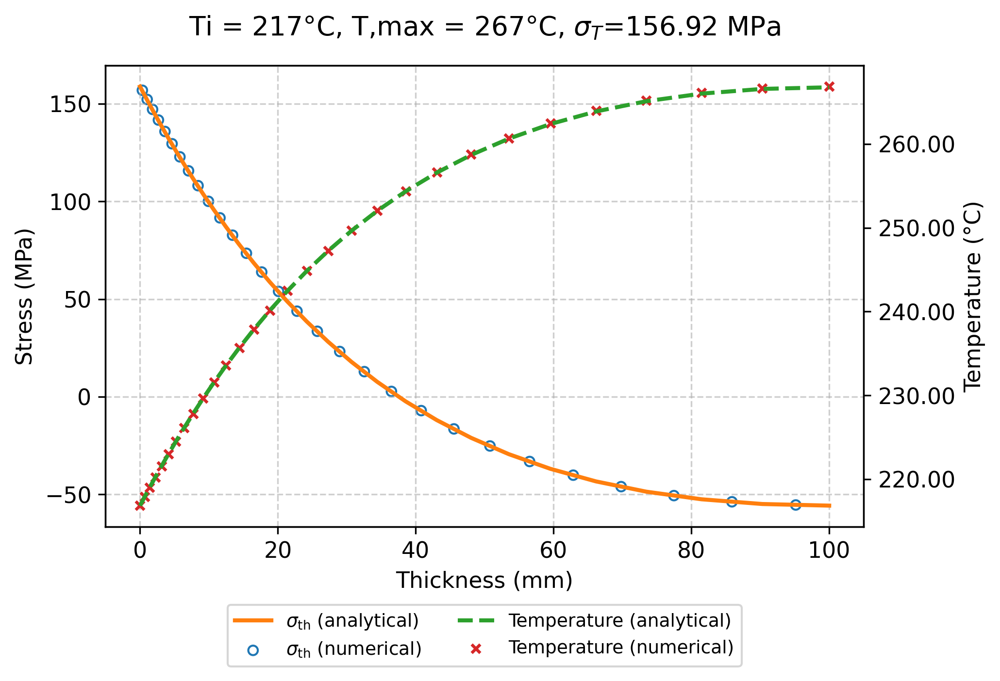
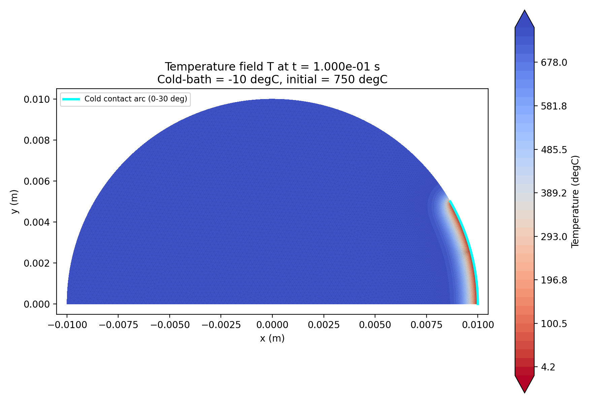
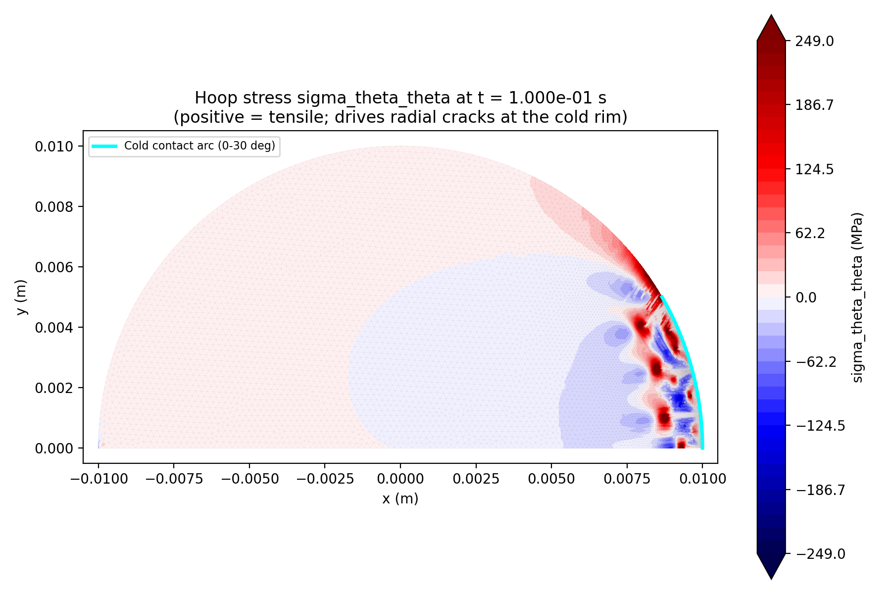
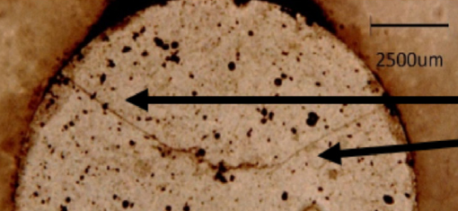

Physics Models
==============

This page states the equations that Z3ST solves, as implemented in
``z3st.models``, ``z3st.core`` and ``z3st.materials``, with the
``input.yaml`` and material-card keys that control them. Defaults are the
values read in the code when a key is absent.

The models are:

- **Heat conduction**, stationary or transient, with Dirichlet, Neumann and
  Robin conditions and gap heat transfer between paired surfaces.
- **Mechanical equilibrium** with small strains and four constitutive routes:
  isotropic linear elasticity (``lame``), Neo-Hookean hyperelasticity
  (``hyperelastic``), J2 plasticity with linear isotropic hardening
  (``plasticity``) and a user stress function (``custom``). Norton thermal
  creep with an irradiation-creep term acts on the ``lame`` route.
- **Phase-field fracture**, AT1 and AT2, in the hybrid formulation of Ambati
  et al. (2015).
- **Fuel models**: burnup accumulation, solid and gaseous swelling with
  densification, radial and axial power shapes, the modified NFI UO\
  :sub:`2` conductivity, isotropic-softening pellet cracking, porosity
  migration and the SCIANTIX fission-gas coupling.
- **Gap conductance** and **penalty contact** between two concentric bodies.
- **Cluster dynamics**, an advection-diffusion equation in the cluster-size
  coordinate.

Anisotropic elasticity is not implemented. Every route above uses an isotropic
stiffness tensor built from :math:`E` and :math:`\nu`.

.. note::

   The material cards in ``z3st/materials`` hold representative values chosen
   for the demonstration and verification cases. They are not qualified design
   data. A card cites the source of a correlation where it has one.

.. contents:: On this page
   :local:
   :depth: 1

Conventions
-----------

- **Regimes.** ``regime`` in ``input.yaml`` is ``1d``, ``2d``, ``3d`` or
  ``axisymmetric`` (default ``2d``). ``2d`` is plane strain,
  :math:`\varepsilon_{zz} = 0`. In ``axisymmetric`` the coordinates are
  :math:`(r, z)`, the hoop strain :math:`\varepsilon_{\theta\theta} = u_r/r` is
  part of the strain tensor, and the volume and surface integrals carry the
  weight :math:`w = 2\pi r`. In the other regimes :math:`w = 1`. The porosity
  transport forms (CG and DG) use unweighted measures in every regime, so in
  ``axisymmetric`` they carry no cylindrical weight. The regime is not refused
  with porosity on. Both porosity cases run in ``2d``. The ``1d``
  regime is a bar in uniaxial stress, :math:`\sigma = E\varepsilon`.
- **Strain tensor.** In the ``2d``, ``3d`` and ``axisymmetric`` regimes the
  strain is stored as a :math:`3\times 3` tensor (``MechanicalModel.epsilon``),
  so eigenstrains act on all three diagonal components.
- **Elements.** Temperature, phase field and (on the default CG path) porosity
  use first-order Lagrange elements: P1 on triangles and tetrahedra, Q1 on
  quadrilaterals and hexahedra. The displacement order is ``mechanical.order``
  (default 1). History fields use DG0 (crack driving force, creep strain) or
  quadrature spaces (plastic strain).
- **Notation.** :math:`d \in [0, 1]` is the phase field (the code field is
  named ``Damage``) and :math:`\ell` the phase-field length, read from
  ``damage.lc``. Superscript :math:`n` denotes the last converged time step and
  :math:`k` the staggered iteration.

Thermal Model
-------------

The temperature :math:`T` satisfies

.. math::

   \rho c_p \frac{\partial T}{\partial t} - \nabla \cdot (k \nabla T) = q''' ,

with the time derivative omitted when ``thermal.analysis: stationary``
(default) and discretised by backward Euler when
``thermal.analysis: transient``. The card keys are ``rho`` (kg/m³), ``cp``
(J/(kg·K)) and ``k`` (W/(m·K)).

**Boundary conditions** (``thermal:`` block of ``boundary_conditions.yaml``):

- ``Dirichlet``: :math:`T = T_d`, key ``temperature``, a scalar or a list with
  one value per generated time point (the sum of the intervals plus one).
- ``Neumann``: :math:`-k\nabla T\cdot\boldsymbol n = q_N`, key ``flux``
  (W/m²). A positive ``flux`` removes heat from the body.
- ``Robin``, convective: :math:`-k\nabla T\cdot\boldsymbol n = h(T - T_\mathrm{ext})`,
  keys ``h_conv`` and ``T_ext``.
- ``Robin``, gap: the same form with :math:`h = h_\mathrm{gap}` from the
  :ref:`gap-conductance model <gap-conductance>` and
  :math:`T_\mathrm{ext} = T_\mathrm{other}`, the temperature at the nearest
  degree of freedom of the paired surface named by the key ``pair``.

**Weak form.** Find :math:`T` such that, for every test function :math:`v`,

.. math::

   \sum_m \int_{\Omega_m} w \left( k \nabla T \cdot \nabla v
   + \frac{\rho c_p}{\Delta t}\, T v \right) \mathrm{d}x
   + \sum_{\Gamma_R} \int_{\Gamma_R} w\, h\, T v \,\mathrm{d}s
   = \sum_m \int_{\Omega_m} w \left( q''' + \frac{\rho c_p}{\Delta t}\, T^n \right) v \,\mathrm{d}x
   - \sum_{\Gamma_N} \int_{\Gamma_N} w\, q_N v \,\mathrm{d}s
   + \sum_{\Gamma_R} \int_{\Gamma_R} w\, h\, T_\mathrm{ext}\, v \,\mathrm{d}s ,

where the terms in :math:`\Delta t` are present only in transient analyses
(``ThermalModel._thermal_step``).

**Conductivity.** ``k`` on a card is one of

- a constant,
- the dotted path of a Python function of :math:`T` returning a UFL
  expression, e.g. ``k: materials.fuel_thermal.k``. It is built on the
  staggered temperature iterate, so it is re-evaluated at every staggered
  iteration (Picard iteration within the step),
- a data-driven model (``type: neural_network``, ``magni`` or ``gpr``, see
  :ref:`nn-material-laws`),
- the porosity-dependent Kato correlation with ``thermal_conductivity_model:
  kato_porosity`` (see :ref:`porosity-migration`).

Damage and the mechanical state do not enter the conductivity.

**Volumetric source.** A material with ``fissile: true`` receives
:math:`q''' = (\mathrm{LHR}/A)\, f_r f_z / \overline{f_r f_z}`, with LHR from
the ``lhr`` history of ``input.yaml``, :math:`A` the fuel cross-section, and
:math:`f_r`, :math:`f_z` the optional :ref:`power shapes <power-shapes>`.
``gamma_heating`` (:math:`q_0`, W/m³) with ``mu_gamma`` (:math:`\mu_\gamma`,
1/m) adds a gamma-heating source: :math:`q_0 e^{-\mu_\gamma x}` for
``geometry_type: rect``, :math:`q_0 K_0(\mu_\gamma r)/K_0(\mu_\gamma R_i)`
for cylinders and :math:`q_0 (R_i/r)\, e^{-\mu_\gamma (r - R_i)}` for spheres,
with :math:`R_i` the geometry ``inner_radius`` or the card key
``gamma_inner_radius``. Both sources may act on the same material and add.

**Solver keys** (``thermal:`` block): ``solver`` (``linear``, default, or
``newton`` for a data-driven :math:`k`), ``linear_solver`` (default
``iterative_hypre``), ``rtol`` (1e-6), ``stag_tol`` (1e-4) and ``convergence``
(``rel_norm`` or ``norm``, required). See :ref:`coupled-scheme`.

Implemented in :class:`z3st.models.thermal_model.ThermalModel`.

   Coupled thermo-mechanical thin slab: temperature and thermal stress through
   the thickness, numerical (markers) against the analytical solution (lines).

.. _nn-material-laws:

Data-Driven Material Laws
-------------------------

The thermal conductivity can be supplied as a trained model. Any Python object
with two methods can be used: one returns :math:`k` and the other returns
:math:`(k, \mathrm{d}k/\mathrm{d}T)`. Three such models ship with the code: a
neural network, the Magni MA-MOX correlation and a Gaussian-process correction
of that correlation.

**Two solver routes**, selected by ``thermal.solver``:

- ``solver: linear`` (Picard). The model is evaluated at the current
  temperature iterate, interpolated into a P1/Q1 coefficient field and used in
  the linear thermal form. The staggered loop iterates the non-linearity.
- ``solver: newton``. The model is wrapped as a ``FEMExternalOperator`` of
  ``dolfinx-external-operator`` (Latyshev et al., 2025), evaluated at the
  quadrature points (degree ``thermal.quadrature_degree``, default 2), and
  :math:`\mathrm{d}k/\mathrm{d}T` enters the Newton tangent. Arguments other
  than :math:`T` (composition, burnup) are held fixed in the linearisation.

The Newton route raises ``NotImplementedError`` for a transient analysis, for
any Robin or gap condition, and when any material lacks a data-driven ``k``
(``ThermalModel._thermal_step_nonlinear``). The neural network needs
``torch`` and the Newton route needs ``dolfinx-external-operator``. The Magni
and Gaussian-process models on the Picard route need neither (see
:doc:`installation`).

Neural network
^^^^^^^^^^^^^^

A small multilayer perceptron :math:`k = \mathrm{NN}(T)` with one activation
for all hidden layers, ``tanh`` (default) or ``softplus``, stored in the
checkpoint. :math:`\mathrm{d}k/\mathrm{d}T` is continuous and is obtained by
automatic differentiation of the network:

.. code-block:: yaml

   k:
     type: neural_network
     weights: knet.pt        # checkpoint, resolved relative to the case directory

The checkpoint stores the weights, the architecture and the input
normalisation. At evaluation, :math:`T` is clamped to the training range
stored in the checkpoint (default: four normalisation scales around the
normalisation centre), with a warning printed once, and :math:`k` is floored at ``k_floor``
(default :math:`10^{-3}` W/(m·K)). The tangent is zero where either guard is
active. The case ``cases/verification/thermal/nn_conductivity_slab_2D``
trains the network on the closed-form law :math:`k = 1/(a + bT)`
(``train_knet.py``), solves with ``solver: newton`` and compares the profile
with the analytical one. Implemented in :mod:`z3st.models.nn_conductivity`.

Magni MA-MOX correlation
^^^^^^^^^^^^^^^^^^^^^^^^

The correlation of Magni et al. (2021) for minor-actinide-bearing MOX depends
on temperature, the Pu, Am and Np contents, the deviation from stoichiometry
``x`` (or ``OM``), the porosity ``p`` and the burnup:

.. code-block:: yaml

   k:
     type: magni
   Pu: 0.20
   Am: 0.00
   x: 0.02
   p: 0.05

The composition keys are read from the ``k`` block or from the card. On the
Newton route, ``Pu_profile: olander`` makes the Pu content a field of radius
and burnup and ``k.use_burnup_field: true`` passes the burnup field to the
model. Implemented in :mod:`z3st.models.magni_conductivity`.

Gaussian-process correction
^^^^^^^^^^^^^^^^^^^^^^^^^^^

A Gaussian process is fitted to the logarithmic residual of the Magni
correlation,

.. math::

   r = \ln\!\left(k_\mathrm{data} / k_\mathrm{Magni}\right),
   \qquad
   k = k_\mathrm{Magni}\, e^{\bar r + \xi s},

with :math:`\bar r` and :math:`s` the posterior mean and standard deviation:

.. code-block:: yaml

   k:
     type: gpr
     model: output/magni_gpr_model.npz
     mode: mean          # or: affine, with xi = number of standard deviations

- The correction multiplies :math:`k_\mathrm{Magni}` by a positive factor, so
  :math:`k > 0`.
- The kernel is a squared exponential with homoscedastic noise and a
  zero-mean prior on standardised variables. The shipped fits use one
  lengthscale for all inputs. Far from the training data
  the posterior mean tends to the mean training residual, so :math:`k` tends to
  the Magni correlation times a constant.
- ``mode: affine`` with ``xi`` (default 0) solves at :math:`\xi` posterior
  standard deviations.

The ``.npz`` checkpoint is produced by
``cases/studies/magni_gpr_conductivity/make_synthetic_gpr.py``, trained on a
residual prescribed in closed form. Each GPR case's ``Allrun`` calls it.
``fit_gpr.py`` in the same directory fits a measured dataset passed with
``--csv``, which is not distributed with the repository. ``verify_machinery.py`` in the same directory
compares the fitted value and temperature derivative with the prescribed ones
over 600 to 1900 K, checks the two methods against a finite difference, and
checks that the fit is flat in the variables the residual does not depend on.
No measured MA-MOX dataset ships with the repository. Implemented in
:mod:`z3st.models.gpr_conductivity`.

Fuel Models
-----------

These models act on materials that opt in on their card.

Burnup
^^^^^^

A ``fissile`` material accumulates a nodal burnup field (MWd/kgU) once per
time step, before the solve, from the source of the new step
(``Spine.update_state``):

.. math::

   \mathrm{bu}^{n+1} = \mathrm{bu}^{n}
   + \frac{q'''\,\Delta t}{\rho\, f_{HM}\; 8.64\times 10^{10}} ,

with ``rho`` from the card and :math:`f_{HM}` = ``heavy_metal_fraction``
(default 0.8815, the U/UO\ :sub:`2` mass ratio). A fissile card without
``rho`` skips the accumulation.

Swelling and densification
^^^^^^^^^^^^^^^^^^^^^^^^^^

``eigenstrain: materials.fuel_swelling.solid_gas_densification`` adds the
isotropic eigenstrain :math:`\boldsymbol\varepsilon^* = (\Delta V/V)/3\,\boldsymbol I` with

.. math::

   \frac{\Delta V}{V} = r_s\,\mathrm{bu} + r_g\,\mathrm{bu}\,S(T)
   - d_0\left(1 - e^{-\mathrm{bu}/\mathrm{bu}_d}\right), \qquad
   S(T) = \left[1 + e^{-(T - T_\mathrm{on})/w_T}\right]^{-1} ,

solid swelling, gaseous swelling and densification. Card keys and defaults
(``z3st.materials.fuel_swelling``):

.. list-table::
   :header-rows: 1

   * - Symbol
     - Key
     - Default
   * - :math:`r_s`
     - ``swelling_rate``
     - 7.0e-4 (1/(MWd/kgU))
   * - :math:`r_g`
     - ``gas_swelling_rate``
     - 4.0e-4 (1/(MWd/kgU))
   * - :math:`T_\mathrm{on}`
     - ``gas_T_onset``
     - 1200 K
   * - :math:`w_T`
     - ``gas_T_width``
     - 150 K
   * - :math:`d_0`
     - ``densification_dv``
     - 0.010
   * - :math:`\mathrm{bu}_d`
     - ``densification_bu``
     - 2.0 MWd/kgU

A constant ``swelling: <ΔV/V>`` on a card adds :math:`(\Delta V/V)/3\,\boldsymbol I`
instead.

UO\ :sub:`2` conductivity
^^^^^^^^^^^^^^^^^^^^^^^^^^

``k: materials.fuel_thermal.k`` is the modified NFI correlation of FRAPCON-3
(Lanning et al., 2005) at zero burnup for 95 % TD UO\ :sub:`2`,

.. math::

   k(T) = \frac{1}{0.0452 + 2.46\times 10^{-4}\, T}
   + \frac{3.5\times 10^{9}}{T^2}\, e^{-16361/T}
   \quad \mathrm{W/(m\,K)} .

Burnup degradation is not included.

.. _power-shapes:

Power shapes
^^^^^^^^^^^^

A fissile card may name a radial shape ``radial_profile`` and an axial shape
``axial_profile`` (dotted paths). ``Spine.set_power`` evaluates them on the
fuel degrees of freedom, multiplies them, and divides by the weighted mean
:math:`\overline{f_r f_z} = \int_{\Omega_m} w f_r f_z\,\mathrm{d}x / \int_{\Omega_m} w\,\mathrm{d}x`,
so :math:`\int_{\Omega_m} w\, q'''\,\mathrm{d}x` equals the nominal power for
any shape. The built-in shapes are in ``z3st.materials.fuel_profiles``:

- ``rim_peaking``: :math:`f_r = 1 + A (r/R)^p`, with :math:`R` the largest fuel
  radius, ``radial_peak_amplitude`` :math:`A` (default 3.0) and
  ``radial_peak_exponent`` :math:`p` (default 8.0). It stands in for the
  Pu-239 build-up at the pellet rim.
- ``chopped_cosine``: :math:`f_z = \max\!\big(0, \cos(\pi (z - z_\mathrm{mid})/L')\big)`,
  with :math:`L'` = ``axial_extrapolated_length`` (default :math:`1.1\,L`, with
  :math:`L` the fuel height).
- ``tabulated_axial``: piecewise-linear interpolation of ``axial_table_z`` and
  ``axial_table_f``, with the end values held outside the table.

.. code-block:: yaml

   fissile: true
   radial_profile: materials.fuel_profiles.rim_peaking
   axial_profile: materials.fuel_profiles.chopped_cosine
   axial_extrapolated_length: 0.5   # (m)

The axial shape acts on the heat source only. An axial variation of the
coolant temperature is imposed separately, through the Robin condition.

Pellet cracking (isotropic softening)
^^^^^^^^^^^^^^^^^^^^^^^^^^^^^^^^^^^^^

``cracking: isotropic`` applies the model of Barani et al., *Nucl. Eng. Des.*
342 (2019): the elastic constants are rescaled from the virgin values as a
function of the number of radial cracks :math:`n`,

.. math::

   E_{iso} = f(\nu)^n E, \qquad
   \nu_{iso} = \frac{\nu}{2^n + (2^n - 1)\nu}, \qquad
   f(\nu) = \frac{2}{3}\,\frac{2-\nu}{2+\nu}\,\frac{1}{1-\nu},

.. math::

   n = n_0 + (n_\infty - n_0)\left[1 - e^{-(\mathrm{LHR}_{max} - \mathrm{LHR}_0)/\tau}\right]
   \quad (\mathrm{LHR}_{max} \ge \mathrm{LHR}_0), \qquad n = 0 \text{ otherwise},

with :math:`\mathrm{LHR}_{max}` the largest rod-average linear heat rate of
the history, so the softening does not recover. Keys and defaults:
``cracking_lhr0`` (5.0e3 W/m), ``cracking_n0`` (1), ``cracking_n_inf`` (12),
``cracking_tau`` (21.0e3 W/m). The rescale is applied once per time step,
before the solve (:class:`z3st.models.cracking_model.CrackingModel`).

.. _porosity-migration:

Porosity migration
^^^^^^^^^^^^^^^^^^

The porosity :math:`p` is transported by

.. math::

   \frac{\partial p}{\partial t} + \nabla\cdot(\boldsymbol v\, p) = 0, \qquad
   \boldsymbol v = v_0\,(c_1 + c_2T + c_3T^2 + c_4T^3)\,T^{-2.5}
   \exp\!\left(-\frac{H_s}{RT}\right)\nabla T ,

the pore velocity of Sens (1972) as used by Barani et al. (2022). Keys in the
``porosity:`` block and defaults: ``v0`` (1.303427e8), ``c1`` (0.988), ``c2``
(6.395e-6), ``c3`` (3.543e-9), ``c4`` (3.0e-12), ``Hs`` (5.98e5 J/mol). The
initial value is the card key ``initial_porosity`` (default 0).

The coupling to the thermal problem runs both ways. The heat source of a
material is scaled by :math:`(1-p)/(1-p_0)`, with :math:`p_0` its
``initial_porosity``. With ``thermal_conductivity_model: kato_porosity`` the
conductivity is the Kato correlation for the dense matrix (card key
``stoichiometry_deviation``, default 0.025) with a Maxwell-Eucken correction
for pores filled with a gas of conductivity ``helium_conductivity`` (default
0.69 W/(m·K)).

Two discretisations are selected by ``porosity.discretisation``:

- ``cg`` (default): P1/Q1, backward Euler, with streamline-upwind artificial
  diffusion (``stabilisation: su``, default) or SUPG (``stabilisation:
  supg``, :math:`\tau = [(2/\Delta t)^2 + (2|\boldsymbol v|/h)^2]^{-1/2}`). The
  solution is clipped to :math:`[0, 1]` after each solve.
- ``dg``: DG1 with an upwind facet flux, integrated by SSP-RK3
  (``dg_integrator: ssprk3``, default) with sub-steps set by the advective CFL
  limit, or by backward Euler (``dg_integrator: be``). The vertex limiter of
  Kuzmin (2010) is applied after every stage (``dg_limiter: vertex``, default,
  or ``clamp`` or ``none``). It preserves cell means and keeps the field in
  :math:`[0, 1]`. The limiter and the saturation cap assume a simplex mesh.

DG keys and defaults: ``dg_cfl`` (1/3), ``dg_cfl_safety`` (0.8),
``dg_max_substeps`` (5000), ``diffusion`` (0, the optional SIPG diffusion is
off), ``sipg_penalty`` (10), ``saturation_cap`` (false: when on, cell means
above 1 are redistributed to neighbours, conserving :math:`\int p`),
``saturation_sweeps`` (200). ``rim_inflow_porosity`` imposes a porosity on
inflow boundaries. When it is unset, the DG inflow value is :math:`p^n` and the
CG path drops the boundary term. On the CG path the boundary is the facet tag
``rim_label`` (default ``outer``).

Common keys: ``linear_solver`` (``direct_mumps``), ``rtol`` (1e-8), ``relax``
(1.0), ``aitken`` (false) with ``aitken_omega0`` (0.5), and the convergence
test ``conv_metric`` (``max_dof``, with ``stag_tol_rel`` 1e-6 and
``stag_tol_abs`` 1e-8, or ``integral``, the relative change of
:math:`\int p` below ``conv_integral_tol``, 1e-4).

Reference cases: ``cases/verification/fuel/porosity_migration`` (CG) and
``cases/verification/fuel/porosity_migration_dg`` (DG). Implemented in
:mod:`z3st.models.porosity_migration_model`.

SCIANTIX coupling (fission gas)
^^^^^^^^^^^^^^^^^^^^^^^^^^^^^^^

With ``models.fission_gas.enabled: true``, Z3ST runs SCIANTIX at every
temperature degree of freedom of the fissile materials, once per time step,
with the local temperature, the fission rate :math:`q'''/E_f`
(``energy_per_fission``, default 3.2e-11 J) and the burnup pair of the step.
The gaseous swelling it returns enters the mechanics through the card key
``eigenstrain: materials.sciantix_swelling.gaseous_swelling`` (or
``with_solid``, ``with_solid_densification`` to add the solid swelling and
densification of ``z3st.materials.fuel_swelling``).

.. code-block:: yaml

   models:
     fission_gas:
       enabled: true
       initial_conditions: input_initial_conditions.txt
       energy_per_fission: 3.2e-11

SCIANTIX must be compiled as a shared library and located through
``models.fission_gas.lib`` or the ``SCIANTIX_LIB`` environment variable (see
``z3st/coupling/sciantix/README.md``). Reference cases:
``cases/regression/fg_test_2D`` (the rod of ``cases/regression/pwr_rod_2D``
with the coupling on) and ``cases/regression/fg_test_fuel``. Implemented in
:mod:`z3st.coupling.sciantix.sciantix_binding`.

Mechanical Model
----------------

The displacement :math:`\boldsymbol u` satisfies quasi-static equilibrium with
small strains,

.. math::

   \nabla\cdot\boldsymbol\sigma + \boldsymbol b = \boldsymbol 0, \qquad
   \boldsymbol\varepsilon = \mathrm{sym}\nabla\boldsymbol u, \qquad
   \boldsymbol\varepsilon_{el} = \boldsymbol\varepsilon - \boldsymbol\varepsilon^*
   - \boldsymbol\varepsilon_{cr} - \boldsymbol\varepsilon_p ,

with the body force :math:`\boldsymbol b = -\rho g\,\boldsymbol e_\mathrm{vertical}`
from ``mechanical.gravity`` (default 0). The eigenstrain is isotropic,

.. math::

   \boldsymbol\varepsilon^* = \left[\alpha (T - T_\mathrm{ref}) + \frac{\Delta V}{3V}\right]\boldsymbol I ,

from the card keys ``alpha`` and ``T_ref`` (thermal part, when the thermal
model is on), ``swelling`` (constant :math:`\Delta V/V`) and ``eigenstrain``
(a callable such as the fuel swelling above).

**Boundary conditions** (``mechanical:`` block of ``boundary_conditions.yaml``):
``Dirichlet`` (full vector ``displacement``), ``Dirichlet_x/y/z`` (one
component), ``Clamp_x/y/z`` (one component set to zero), ``Slip_x/y/z`` (the
named component free, the others zero) and ``Neumann`` (key ``traction``, a
normal traction :math:`t_N\boldsymbol n`). Values may be lists with one entry
per generated time point (the sum of the intervals plus one).

**Weak form** (linear elastic path):

.. math::

   \sum_m \int_{\Omega_m} w\, g(d)\, \mathbb C : \boldsymbol\varepsilon(\boldsymbol u) : \boldsymbol\varepsilon(\boldsymbol v)\,\mathrm{d}x
   = \sum_m \int_{\Omega_m} w\, \boldsymbol b \cdot \boldsymbol v \,\mathrm{d}x
   + \sum_m \int_{\Omega_m} w\, g(d)\, \mathbb C : \boldsymbol\varepsilon^* : \boldsymbol\varepsilon(\boldsymbol v)\,\mathrm{d}x
   + \sum_{\Gamma_N} \int_{\Gamma_N} w\, t_N\, \boldsymbol n \cdot \boldsymbol v \,\mathrm{d}s
   - \sum_{\Gamma_c} \int_{\Gamma_c} w\, P_c\, \boldsymbol n \cdot \boldsymbol v \,\mathrm{d}s ,

with :math:`g(d) = 1` when damage is off and :math:`P_c` the
:ref:`contact pressure <penalty-contact>`. When damage is on, the elastic
stress and the eigenstress are both multiplied by :math:`g(d)`, so a cell with
:math:`d \to 1` carries neither.

**Solution path.** The step is solved as a linear problem when
``mechanical.solver: linear`` and no material creeps, is plastic or is
hyperelastic. Otherwise the residual
:math:`F(\boldsymbol u; \boldsymbol v) = \int w\, \boldsymbol\sigma(\boldsymbol u):\boldsymbol\varepsilon(\boldsymbol v)\,\mathrm{d}x - (\text{right-hand side})`
is solved by Newton's method in PETSc SNES with the Jacobian from
``ufl.derivative`` (see :ref:`coupled-scheme` for the solver options).
``mechanical.solver`` is a required key.

Constitutive routes
^^^^^^^^^^^^^^^^^^^

The route is the card key ``constitutive`` (default ``lame``):

- ``lame``: :math:`\boldsymbol\sigma = \lambda\,\mathrm{tr}(\boldsymbol\varepsilon)\boldsymbol I + 2\mu\boldsymbol\varepsilon`
  minus the eigenstress, from ``E`` and ``nu``. ``E`` and ``nu`` may be dotted
  paths of functions of :math:`T`.
- ``hyperelastic``: compressible Neo-Hookean,
  :math:`\psi(\boldsymbol F) = \tfrac{\mu}{2}(\mathrm{tr}\,\boldsymbol C - 3) - \mu\ln J + \tfrac{\lambda}{2}(\ln J)^2`,
  with :math:`\boldsymbol F = \boldsymbol I + \nabla\boldsymbol u`,
  :math:`\boldsymbol C = \boldsymbol F^\top\boldsymbol F`,
  :math:`J = \det\boldsymbol F`. The first Piola-Kirchhoff stress is
  ``P = ufl.diff(psi, F)`` and the Cauchy stress
  :math:`J^{-1}\boldsymbol P\boldsymbol F^\top`. Verified by
  ``cases/verification/mechanics/uniaxial_tension_nonlinear``.
- ``plasticity``: J2, below. A ``lame`` card that has ``yield_strength`` is
  promoted to this route when ``models.plasticity`` is on.
- ``custom``: ``stress_function`` names a Python function
  ``f(u, T, material, model=...)`` that returns the stress as a UFL tensor.

Implemented in :class:`z3st.models.mechanical_model.MechanicalModel`.

.. figure:: images/cylindrical_shell/stress_comparison.png
   :width: 75%
   :align: center

   Linear elasticity: radial and hoop stress in a thick cylindrical shell,
   numerical against the analytical Lamé solution.

J2 plasticity
^^^^^^^^^^^^^

Small-strain von Mises plasticity with linear isotropic hardening, card keys
``yield_strength`` (:math:`\sigma_y`) and ``hardening_modulus`` (:math:`H`).
The return map is written in UFL (``PlasticityModel._j2_return_map``):

.. math::

   \boldsymbol\sigma^{tr} = \mathbb C : (\boldsymbol\varepsilon - \boldsymbol\varepsilon_p^n), \qquad
   f = \sigma_{eq}^{tr} - (\sigma_y + H p^n), \qquad
   \Delta p = \frac{\langle f \rangle_+}{3\mu + H},

.. math::

   \boldsymbol\sigma = \boldsymbol\sigma^{tr} - 3\mu\,\Delta p\,\boldsymbol n, \qquad
   \boldsymbol n = \frac{\boldsymbol s^{tr}}{\sigma_{eq}^{tr}}, \qquad
   \Delta\boldsymbol\varepsilon_p = \tfrac32\,\Delta p\,\boldsymbol n ,

with :math:`\sigma_{eq} = \sqrt{\tfrac32\,\boldsymbol s:\boldsymbol s}`. The
plastic strain tensor and the cumulative plastic strain :math:`p` live on
quadrature spaces of degree :math:`2k+1`, with :math:`k` the displacement
order, and the volume integrals use the same degree. The history is updated
once per time step, after the staggered loop ends (``Solver.solve_staggered``).

The trial elastic strain is the total strain minus the plastic strain only.
The thermal and swelling eigenstress is assembled in the residual, but the
yield check does not subtract the eigenstrain. J2 plasticity should therefore
be used only where no thermal or swelling eigenstrain is present. Verified by
``cases/verification/plasticity/j2_hardening_2D``.

.. figure:: images/plasticity_2D/output/stress_strain_curve.png
   :width: 65%
   :align: center

   J2 plasticity: stress-strain response, numerical against analytical (plane
   strain), with the elastic slope and the linear hardening branch.

Crystal plasticity (custom route)
^^^^^^^^^^^^^^^^^^^^^^^^^^^^^^^^^

``plasticity.mode: custom`` replaces the J2 history update with the function
``get_cp_internal_variables`` of the module that holds ``stress_function``.
The case ``cases/verification/plasticity/crystal_single_grain`` uses it for
rate-dependent plasticity of one FCC grain with the single slip system
:math:`(111)[01\bar{1}]`:

.. math::

   \boldsymbol\sigma = \mathbb C : (\boldsymbol\varepsilon - \boldsymbol\varepsilon^p), \qquad
   \dot{\boldsymbol\varepsilon}^p = \dot\gamma\,\boldsymbol P, \qquad
   \boldsymbol P = \tfrac12(\boldsymbol m\otimes\boldsymbol n + \boldsymbol n\otimes\boldsymbol m), \qquad
   \dot\gamma = \dot\gamma_0 \left|\frac{\tau}{g_0}\right|^{n}\mathrm{sign}(\tau), \qquad
   \tau = \boldsymbol\sigma:\boldsymbol P ,

integrated by backward Euler, with the Newton tangent from ``ufl.derivative``.

.. figure:: images/demo_CP_single_grain/output/stress_strain_curve.png
   :width: 65%
   :align: center

   Crystal plasticity (single grain): the response approaches the analytical
   saturation stress :math:`\sigma_{sat}`.

Creep
^^^^^

A card with ``creep: norton`` and the keys ``creep_A0`` (Pa\ :sup:`-n`/s),
``creep_n`` and ``creep_Q`` (J/mol) follows

.. math::

   \dot\varepsilon^{cr}_{eq} = A_0\, e^{-Q/RT}\,\sigma_{eq}^{\,n} + B\phi\,\sigma_{eq},
   \qquad
   \dot{\boldsymbol\varepsilon}_{cr} = \dot\varepsilon^{cr}_{eq}\,\tfrac32\,\frac{\boldsymbol s}{\sigma_{eq}} ,

thermal Norton creep plus an irradiation-creep term that is present only when
both ``creep_irr_B`` (:math:`B`) and ``fast_flux`` (:math:`\phi`) are on the
card. Backward Euler with a radial return gives one scalar equation per point
for the increment :math:`\Delta\gamma`,

.. math::

   \Delta\gamma - \Delta t\, A(T)\, b^n - \Delta t\, B\phi\, b = 0, \qquad
   b = \sigma_{eq}^{tr} - 3\mu\,\Delta\gamma ,

where the trial stress uses
:math:`\boldsymbol\varepsilon - \boldsymbol\varepsilon^* - \boldsymbol\varepsilon_{cr}^n`.
A vectorised NumPy Newton solves this equation on a DG0 predictor field
before every mechanical solve, and the UFL stress carries one further Newton
correction from that predictor, so ``ufl.derivative`` gives the consistent
tangent (:mod:`z3st.models.creep_model`). The relative change of the predictor
enters the staggered convergence test of the mechanical block. The creep strain
is stored on a DG0 tensor field per material and updated once per time step.
Creep forces the SNES path. Without the thermal model, :math:`A(T)` is
evaluated at the card ``T_initial``. Verified by
``cases/verification/fuel/creep``, ``creep_irradiation`` and
``creep_relaxation``.

.. _model-restrictions:

Combinations refused at load
^^^^^^^^^^^^^^^^^^^^^^^^^^^^

``Spine.load_materials`` and :class:`z3st.core.config.Config` raise an
error for:

- creep with damage, plasticity or the cohesive model in the same run,
- creep on any route other than ``lame``,
- a plastic material (``constitutive_mode`` ``plasticity``) with damage. The
  plastic work does not enter the crack driving force, so the combination
  would not be a ductile-fracture model,
- the cohesive model without ``models.mechanical``, or with damage or
  plasticity,
- an irradiation-creep card with only one of ``creep_irr_B`` and ``fast_flux``.

Phase-Field Fracture
--------------------

The phase field follows the hybrid formulation of Ambati et al. (2015, their
Eq. 27). The whole stress is degraded,

.. math::

   \boldsymbol\sigma = g(d)\, \mathbb C : \boldsymbol\varepsilon_{el}, \qquad
   g(d) = (1-d)^2 + K, \qquad K = 10^{-6},

so the momentum balance keeps the form of the undamaged model, while only the
tensile part :math:`\psi^+` of the elastic energy drives the crack through the
history field :math:`\mathcal H`. The coupled system does not derive from an
energy functional. For the consequences on the staggered solver see
:ref:`staggered-theory`.

**AT2** (``damage.type: AT2``):

.. math::

   -\ell^2\Delta d + (1 + \mathcal H)\,d = \mathcal H, \qquad
   \mathcal H = \max_{\tau\le t}\frac{2\ell}{G_c}\,\psi^+(\boldsymbol\varepsilon_{el}) .

**AT1** (``damage.type: AT1``, Pham et al. 2011):

.. math::

   -\tfrac34 G_c\ell\,\Delta d + 2\mathcal H d = 2\mathcal H - \tfrac{3G_c}{8\ell},
   \qquad \mathcal H = \psi^+ ,

solved with a diagonal shift :math:`10^{-8} G_c/\ell` on the left-hand side.
The constant term gives AT1 an elastic threshold, :math:`d` stays zero until
:math:`2\mathcal H > 3G_c/(8\ell)`. The weak forms are those of
``DamageModel._damage_step``, with the weight :math:`w`.

**Crack driving force.** :math:`\psi^+` is evaluated on
:math:`\boldsymbol\varepsilon_{el} = \boldsymbol\varepsilon - \alpha(T - T_\mathrm{ref})\boldsymbol I`.
The swelling and callable eigenstrains are not subtracted. In the ``2d``
regime the :math:`zz` component of the thermal eigenstrain is omitted from the
driving force and from ``MechanicalModel.elastic_energy_density``, which gives
the ``StrainEnergyDensity`` output and the ``E_el`` column of ``energies.txt``.
The equilibrium keeps it. In plane strain the axial expansion is blocked, and
keeping the :math:`zz` term would drive damage through the deviatoric part. With :math:`\langle x\rangle_\pm = (x\pm|x|)/2` and
:math:`K_n = \lambda + 2\mu/n_d`, where :math:`n_d` is the dimension of the
strain tensor (3 in the ``2d``, ``3d`` and ``axisymmetric`` regimes, so
:math:`K_n` is the bulk modulus), the splits selected by ``damage.split`` are

- ``amor``, volumetric-deviatoric (Amor et al. 2009):
  :math:`\psi^+ = \tfrac{K_n}{2}\langle\mathrm{tr}\,\boldsymbol\varepsilon_{el}\rangle_+^2 + \mu\,\mathrm{dev}\,\boldsymbol\varepsilon_{el}:\mathrm{dev}\,\boldsymbol\varepsilon_{el}`,
- ``miehe``, spectral (Miehe et al. 2010):
  :math:`\psi^+ = \tfrac{\lambda}{2}\langle\mathrm{tr}\,\boldsymbol\varepsilon_{el}\rangle_+^2 + \mu\sum_i\langle\varepsilon_i\rangle_+^2`,
  with the principal strains from Cardano's formula,
- ``star_convex`` (Vicentini et al. 2024):
  :math:`\psi^+ = \mu|\mathrm{dev}\,\boldsymbol\varepsilon_{el}|^2 + \tfrac{K_n}{2}\big(\langle\mathrm{tr}\,\boldsymbol\varepsilon_{el}\rangle_+^2 - \gamma^*\langle\mathrm{tr}\,\boldsymbol\varepsilon_{el}\rangle_-^2\big)`,
  with :math:`\gamma^*` = ``damage.gamma_star`` (default 0, which reduces to
  ``amor``).

Without ``split`` the default is ``miehe`` for AT2 and ``amor`` for AT1
(``DamageModel.psi_split``).

**Hybrid constraint.** With ``damage.hybrid_constraint: true`` (default), the
new contribution to :math:`\mathcal H` is set to zero in every cell where
:math:`\psi^- > \psi^+`, so damage does not grow under compression.

**Irreversibility.** :math:`\mathcal H` is stored on DG0 cells. AT2 takes
:math:`\mathcal H^{n+1} = \max(\mathcal H^n, \mathcal H)` against the value of
the last converged step. AT1 stores the current :math:`\mathcal H` and relies
on the projection of :math:`d`. After each damage solve the field is projected,
:math:`d \leftarrow \min(1, \max(d, d^n))`, with :math:`d^n` the value at the
start of the step (for AT1 the solution is also clipped to :math:`[0, 1]`
before relaxation).

**Material data.** Every material of the domain takes part in the damage
problem and needs ``E`` and ``Gc`` or ``sigma_c`` (:math:`\sigma_c`). With
``damage.lc`` set, the missing one is derived at load
(``Spine.load_materials``):

.. math::

   \text{AT1: } G_c = \frac{8}{3}\,\frac{\ell\,\sigma_c^2}{E}, \qquad
   \text{AT2: } G_c = \frac{256}{27}\,\frac{\ell\,\sigma_c^2}{E} .

When both are on the card, ``sigma_c`` sets ``Gc``. Without ``lc`` both must
be given. ``Gc`` may be the dotted
path of a function of the mesh, which gives a spatially varying
:math:`G_c(\boldsymbol x)`.

**Scope.** Damage does not modify the thermal conductivity, and the plastic
strain does not enter :math:`\psi^+`.

**Pre-cracks.** A ``Dirichlet`` entry with ``value`` in the ``damage:`` block of
``boundary_conditions.yaml`` fixes :math:`d` on a tagged facet set, e.g.
:math:`d = 1` on an internal line.

**Keys** (``damage:`` block, required when ``models.damage`` is on): ``type``
(``AT1`` or ``AT2``, required), ``lc``, ``split``, ``gamma_star`` (0),
``hybrid_constraint`` (true), ``linear_solver`` (``iterative_hypre``),
``rtol`` (1e-6), ``stag_tol`` (1e-4), ``convergence`` (required).

**Monitoring.** For damage runs the elastic energy
:math:`\int w\, g(d)\,\psi(\boldsymbol\varepsilon_{el})\,\mathrm{d}x` and the
fracture energy
:math:`\int w\, \tfrac{G_c}{c_w}\big(\omega(d)/\ell + \ell|\nabla d|^2\big)\mathrm{d}x`
(:math:`c_w = 2`, :math:`\omega = d^2` for AT2, :math:`c_w = 8/3`,
:math:`\omega = d` for AT1) are written to ``energies.txt`` at every step.
Their sum is not a conserved quantity of the hybrid formulation.

Implemented in :class:`z3st.models.damage_model.DamageModel`.

.. figure:: images/sen_shear/SENS_damage_final.png
   :width: 55%
   :align: center

   Single-edge-notched shear test (``cases/benchmarks/damage/sen_shear``),
   the benchmark of Miehe et al., *Comput. Methods Appl. Mech. Engrg.* 199
   (2010).

A cohesive phase-field model with a prescribed strength surface (``models.cohesive``)
is under development and is described in :doc:`in_development`.

.. _gap-conductance:

Gap Conductance
---------------

Heat transfer across the gap between two bodies is a Robin condition on each
of the two surfaces, :math:`-k\nabla T\cdot\boldsymbol n = h_\mathrm{gap}(T - T_\mathrm{other})`,
declared with a ``pair`` entry in ``boundary_conditions.yaml``. The
conductance (``GapModel.set_gap_conductance``) is

.. math::

   h_\mathrm{gap} = \frac{k_\mathrm{gas}(\bar T_\mathrm{gap})}{\delta}
   + C\,\frac{2k_fk_c}{k_f+k_c}\,\frac{P_c}{H_M\sqrt{\delta_g}} ,

with the keys of the ``models.gap_conductance`` block:

- ``type: Fixed``: :math:`h_\mathrm{gap}` = ``value`` (W/(m²·K)).
- ``type: Gas``: :math:`k_\mathrm{gas} = a\cdot 10^{-4}\,\bar T_\mathrm{gap}^{0.79}`
  W/(m·K) with :math:`a` = ``value`` (Todreas and Kazimi, Eq. 8.140, where
  :math:`a` = 15.8 for helium, 1.97 argon, 1.15 krypton, 0.72 xenon).
  :math:`\bar T_\mathrm{gap}` is the average of the two surface means of the
  nodal temperature. :math:`\delta` is the mean distance from each facet centroid of
  ``surface_a`` (default ``lateral_1``) to the nearest facet centroid of
  ``surface_b`` (default ``inner_2``). When the contact model is on, :math:`\delta`
  is instead the gap measured by the contact model, floored at
  ``contact_coupling.gas_thickness``.

No temperature-jump distances and no radiative term are included.

The second term is the Ross-Stoute solid-contact conductance (Todreas and
Kazimi, Eq. 8.141). It is added only when the contact model is on and
``contact_coupling.enabled: true`` (default false), and only while
:math:`P_c > 0`. :math:`C = 18.11` m\ :sup:`-1/2`, :math:`H_M` =
``contact_coupling.meyer_hardness`` (default 9.65e8 Pa),
:math:`\delta_g` = ``contact_coupling.gas_thickness`` (default 4.0e-6 m),
and :math:`k_f`, :math:`k_c` are the conductivities of the two paired
materials (a function :math:`k(T)` is evaluated at :math:`\bar T_\mathrm{gap}`).

:math:`h_\mathrm{gap}` is referred to ``surface_a``. On the other surface it is
multiplied by :math:`\int_{\Gamma_a} w\,\mathrm{d}s / \int_{\Gamma_b} w\,\mathrm{d}s`
(:math:`r_a/r_b` for coaxial cylinders), so the heat leaving one body equals
the heat entering the other for a uniform temperature jump. The conductance is
updated at every staggered iteration and may be under-relaxed with ``relax``
(default 1.0, no relaxation). The contact pressure used is the one of the
previous mechanical solve. Implemented in :class:`z3st.models.gap_model.GapModel`.

.. _penalty-contact:

Penalty Contact
---------------

Contact between two concentric bodies separated by a uniform gap, such as
pellet and cladding, is enforced by a penalty on the mean gap
(:class:`z3st.models.contact_model.ContactModel`). With
:math:`\bar u_a` and :math:`\bar u_b` the mean normal displacements of the two
facing surfaces,

.. math::

   \bar u_\Gamma = \frac{\int_\Gamma \boldsymbol u\cdot\boldsymbol n_\Gamma\,\mathrm{d}s}{\int_\Gamma\mathrm{d}s},
   \qquad
   g = g_0 + \bar u_b - \bar u_a, \qquad
   P_c = k_\mathrm{pen}\max(0, -g),

with the sign of :math:`\bar u_b` taken along the outward normal of the inner
body. :math:`P_c` is applied as the uniform traction :math:`-P_c\boldsymbol n`
on both surfaces and is updated after every mechanical solve. Once two
(pressure, gap) samples of the same time step are available, the pressure is
set by a secant step on the affine relation :math:`g(P) = g_\mathrm{free} + C P`,

.. math::

   C = \frac{g_1 - g_0}{P_1 - P_0}, \qquad
   P^* = \frac{C P_1 - g_1}{C + 1/k_\mathrm{pen}} ,

and falls back to the explicit update when the two pressures are too close or
:math:`C \le 0`. The history is reset at every step.

The contact pressure is one scalar per surface pair. The method is not a
pointwise contact constraint, it carries no friction, and a finite
:math:`k_\mathrm{pen}` leaves a penetration of order :math:`P_c/k_\mathrm{pen}`.

**Keys** (``models.contact`` block): ``surface_a`` (default ``lateral_1``),
``surface_b`` (default ``inner_2``), ``penalty_stiffness``
(:math:`k_\mathrm{pen}`, default 5.0e13 Pa/m) and ``initial_gap``
(:math:`g_0`, default ``inner_radius_2 - outer_radius_1`` from the geometry
file). A negative ``initial_gap`` is an interference.

**Verification.** ``cases/verification/fuel/shrink_fit`` heats the pellet
uniformly against a cladding held at its reference temperature, so the radial
interference is :math:`\delta = \alpha_f (T - T_\mathrm{ref})\, b - g_0`, and
compares :math:`P_c` with the plane-stress Lamé interference pressure

.. math::

   p_{\mathrm{Lame}} = \frac{\delta}{\,b\left[\dfrac{1}{E_c}\!\left(\dfrac{c^2+b^2}{c^2-b^2}+\nu_c\right) + \dfrac{1}{E_f}\left(1-\nu_f\right)\right]},

with :math:`b` the interface radius and :math:`c` the cladding outer radius.
Over the closed-gap steps the deviation, normalised by the peak pressure of
75 MPa, is 1.0 % at most and 0.5 % on average (``non-regression.py`` of the
case). The other shrink-fit cases (``shrink_fit_disk``,
``shrink_fit_disk_3d``, ``creep_shrink_fit_2D``) are listed in
:doc:`examples`.

``cases/regression/pwr_rod_2D`` uses the contact model with the
contact-coupled gap conductance on an axisymmetric UO\ :sub:`2` and Zircaloy
rod with a 65 µm gap.

Cluster Dynamics
----------------

:class:`z3st.models.cluster_dynamic_model.ClusterDynamicsModel` solves, on a
one-dimensional mesh whose coordinate is the cluster size :math:`n`,

.. math::

   \frac{\partial c}{\partial t} + v\, \frac{\partial c}{\partial n} - D\, \frac{\partial^2 c}{\partial n^2} = 0,

with ``cluster.advection_velocity`` :math:`v` (default 1.0) and
``cluster.diffusion_coefficient`` :math:`D` (default 0.5). The discretisation
is DG1 with an upwind flux for advection and symmetric interior penalty for
diffusion (penalty 10), with backward Euler in time. The initial condition
(``cluster.initial_condition``) is ``constant`` (``value`` on ``region``,
optional ``total_mass``) or ``gaussian`` (``mean`` 5.0, ``std_dev`` 1.0,
``amplitude`` 1000 as the total mass). After every solve the distribution is
rescaled so that :math:`\int c\,n\,\mathrm{d}n` equals its initial value, so
mass conservation is imposed by the rescaling. The cell Péclet number is
written to the log. Reference case: ``cases/verification/cluster/mass_conservation_1D``.

.. _coupled-scheme:

Coupled Solution
----------------

Within each time step the active blocks are solved in the order temperature,
displacement, damage, cluster, porosity, each with the others fixed
(``Solver.solve_staggered``), and the sequence is repeated. The gap
conductance and the contact pressure are updated inside this loop. The
mechanical forms hold the damage field by reference, so each mechanical solve
sees the latest damage iterate and damage is coupled within the step. At the
start of a step the field holds :math:`d^n`.

**Convergence.** For temperature, displacement and damage the test is

.. math::

   \frac{\|X^k - X^{k-1}\|_2}{\|X^k\|_2} < \texttt{stag\_tol}_X
   \quad (\texttt{convergence: rel\_norm}), \qquad
   \|X^k - X^{k-1}\|_2 < \texttt{stag\_tol}_X
   \quad (\texttt{convergence: norm}),

with :math:`X^k` the unrelaxed solution of the iteration, so the measure does
not depend on the relaxation factor. ``stag_tol`` (default 1e-4) and
``convergence`` (required) are set per block. The creep predictor and the
porosity add their own tests (above). The step has converged when all active
tests pass in the same iteration. The maximum number of iterations is
``solver_settings.max_iters`` (default 100). A step that reaches it is accepted
with a warning, unless ``time_adaptivity.enabled: true``, in which case the
step is rolled back and bisected, down to ``time_adaptivity.dt_min`` (default
1e3 s) or ``max_cuts`` (default 6) bisections, after which the run stops. The
plastic and creep histories are updated once, at the end of the step.

**Relaxation** (``solver_settings`` block). Each update is relaxed,
:math:`X \leftarrow \omega X^k + (1-\omega) X^{k-1}`:

- fixed factors ``relax_T`` (0.9), ``relax_u`` (0.4), ``relax_D`` (0.4),
- ``relax_adaptive: true`` (default false): an exponential moving average
  :math:`\bar r \leftarrow 0.3\,r + 0.7\,\bar r` of the residual is kept per
  field, and the factor is multiplied by ``relax_growth`` (1.2) when the
  residual is below the average and by ``relax_shrink`` (0.5) otherwise,
  clamped to [``relax_min``, ``relax_max``] = [0.05, 1.0]. The adapted factors
  carry over to the next step,
- ``relax_aitken: true`` (default false): Aitken's :math:`\Delta^2` factor for
  the displacement,
  :math:`\omega_{k+1} = -\omega_k\, r_{k-1}\cdot\Delta r / |\Delta r|^2`,
  clamped to the same bounds and restarted from ``relax_u`` at every step. It
  replaces the adaptive rule for :math:`\boldsymbol u`.

With the default ``relax_max = 1.0`` no factor exceeds one. See
:ref:`staggered-theory` for what the converged fixed point represents.

**Linear solvers** (``linear_solver`` per block,
``Solver.get_solver_options``):

- ``iterative_hypre`` (default for thermal, mechanical and damage): CG for
  thermal and damage, GMRES for mechanics, with hypre BoomerAMG,
- ``iterative_amg``: the same Krylov methods with PETSc GAMG. On the linear
  mechanical path the operator receives the rigid-body modes as
  near-nullspace,
- ``direct_mumps``: LU with MUMPS (default for porosity).

``mechanical.remove_rigid_nullspace: true`` (default false) removes, on the
linear mechanical path only, the rigid-body modes that the Dirichlet
conditions leave free.

**Non-linear mechanics.** The SNES path (creep, plasticity, hyperelasticity,
or ``mechanical.solver`` other than ``linear``) uses ``newtonls`` with
``snes_atol = snes_rtol = mechanical.rtol``. With ``direct_mumps`` the line
search is ``basic`` and the iteration limit is ``mechanical.snes_max_it``
(default 50). With an iterative inner solver the line search is ``bt`` and the
limit is fixed at 100.

Application: thermal shock of a UO\ :sub:`2` pellet
---------------------------------------------------

``cases/benchmarks/damage/pellet_quench_2D_xy`` couples temperature,
displacement and damage on a plane-strain cross-section of a UO\ :sub:`2`
pellet after McClenny et al., *J. Nucl. Mater.* 565 (2022). A cold arc cools
the rim of the hot disc and the tensile hoop stress it produces drives radial
cracks. The case uses AT1, the star-convex split with :math:`\gamma^* = 0`
(equal to the volumetric-deviatoric split), the hybrid constraint and
:math:`\ell = 50` µm.

   Temperature after the cold contact (left) and the tensile hoop stress at
   the rim (right).

.. figure:: images/full_cylinder_cracking/damage_field.png
   :width: 49%

   Computed phase field with radial cracks at the rim (left) and a
   cross-section of a cracked UO\ :sub:`2` pellet (right).

**See also**

- :doc:`examples` -- the verification-case catalogue
- :doc:`differentiable_features` -- automatic differentiation in Z3ST
- :doc:`usage` -- YAML configuration
- :doc:`api` -- implementation reference
